# Training stuck $$\not=$$ Small Gradient
collapsed:: true
	- Training stuck
	  collapsed:: true
		- 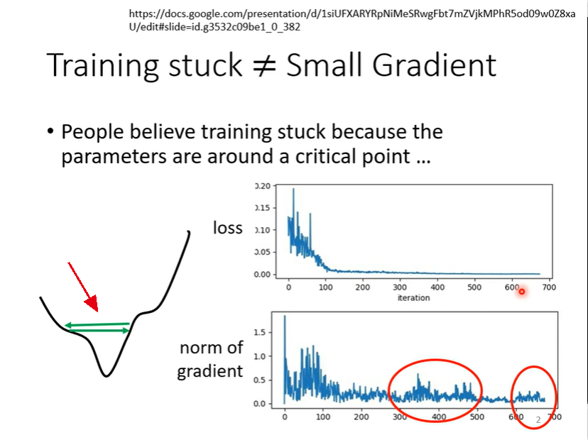
	- Wait a minute (**Training can be difficult even without critical points**)
	  collapsed:: true
		- 
		- 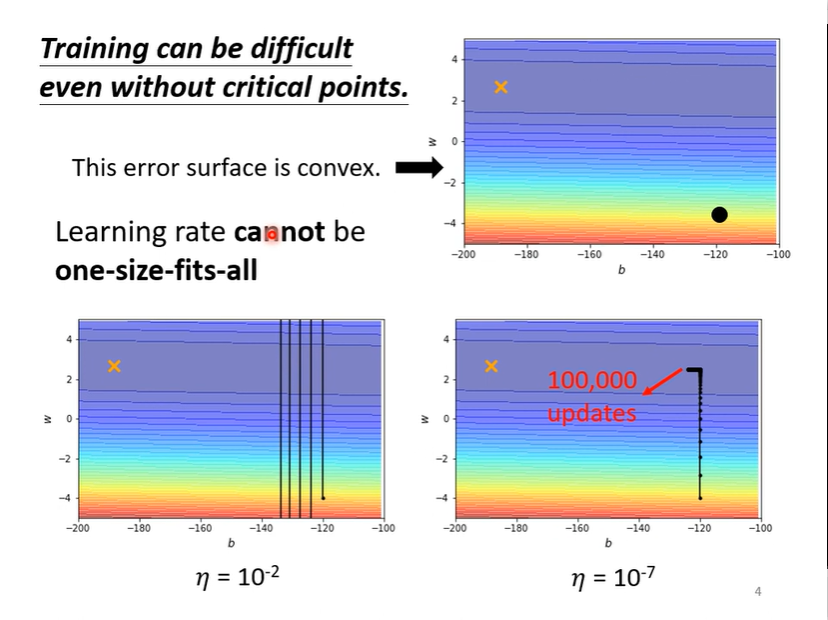
	- Different parameters needs different learning rate
	  collapsed:: true
		- Introduction (Parameters dependent $$\sigma^t_i$$)
		  collapsed:: true
			- 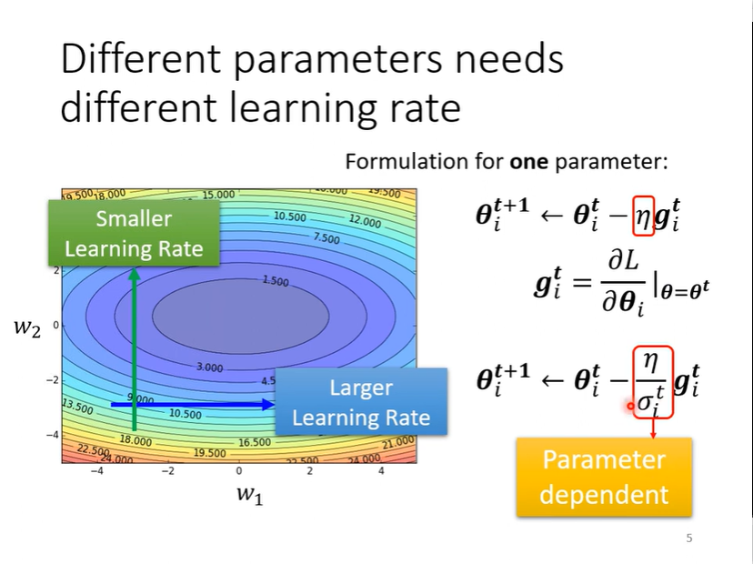
		- Root Mean Square
		  collapsed:: true
			- How?
			  collapsed:: true
				- 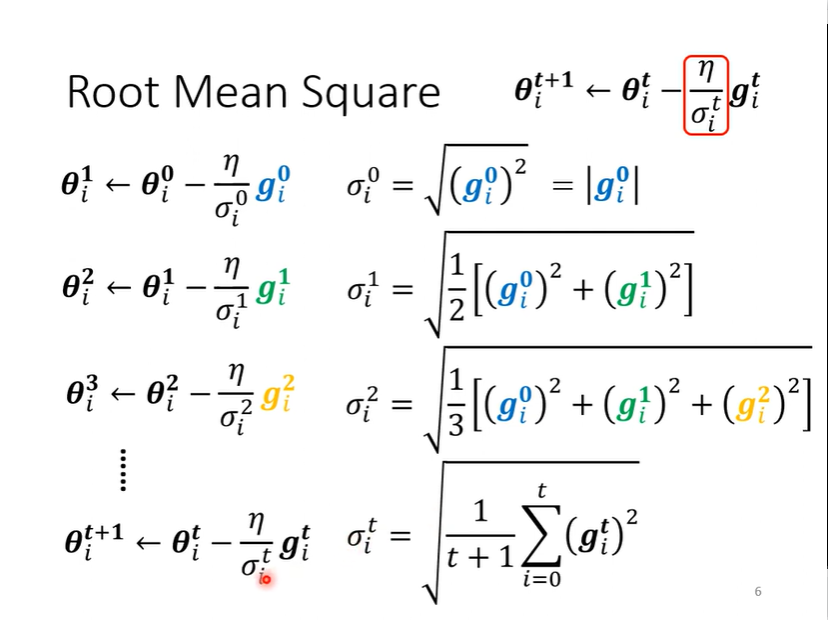
			- Why?
			  collapsed:: true
				- The bigger $$g$$ is, the smaller $$\frac \eta\sigma$$ value is
				- 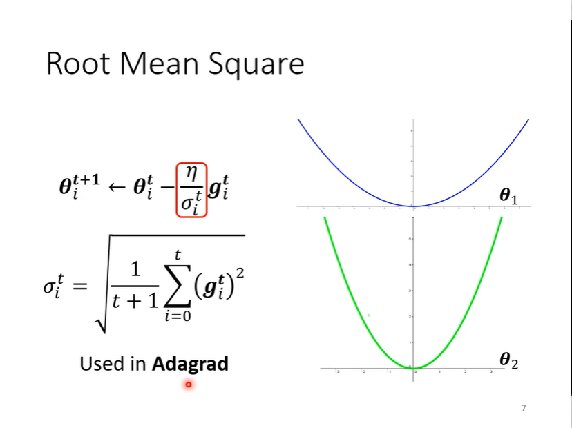{:height 501, :width 659}
			- The disadvantage
			  collapsed:: true
				- 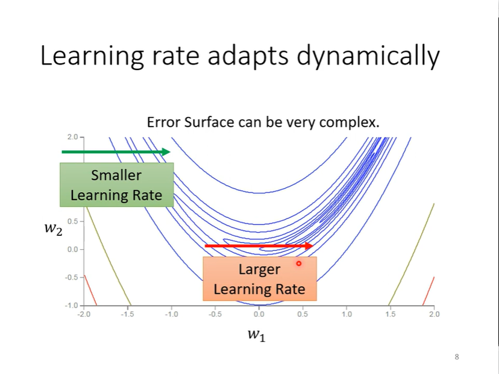
		- RMSProp
		  collapsed:: true
			- Introduction
			  collapsed:: true
				- 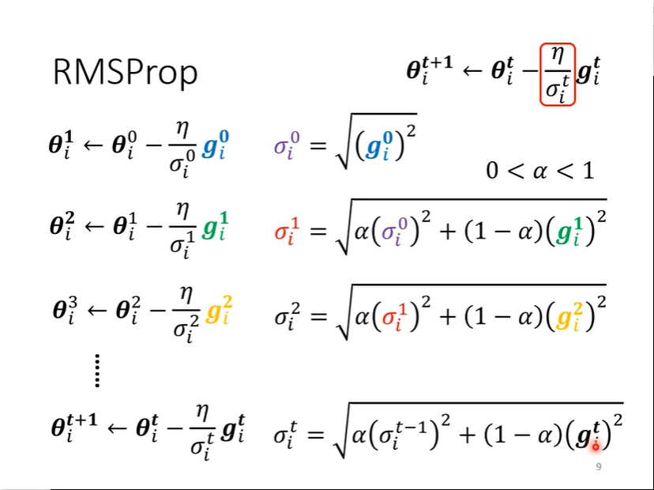
			- why?
			  collapsed:: true
				- 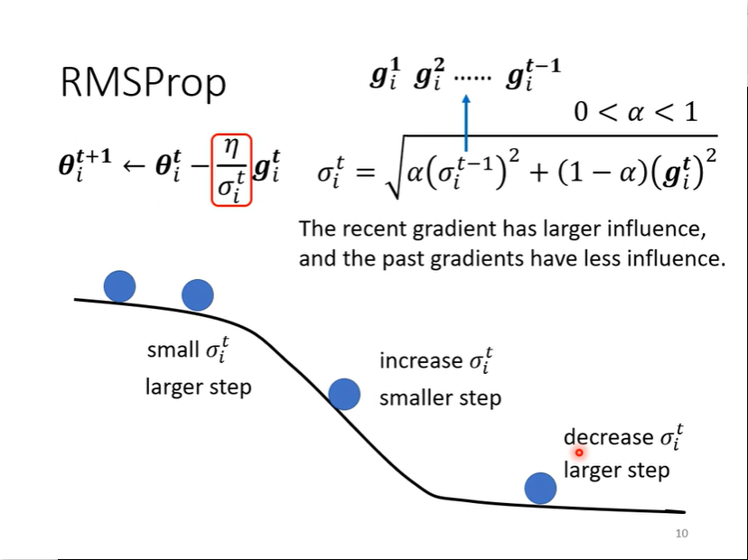
		- Adam: RMSProp + Momentum
		  collapsed:: true
			- 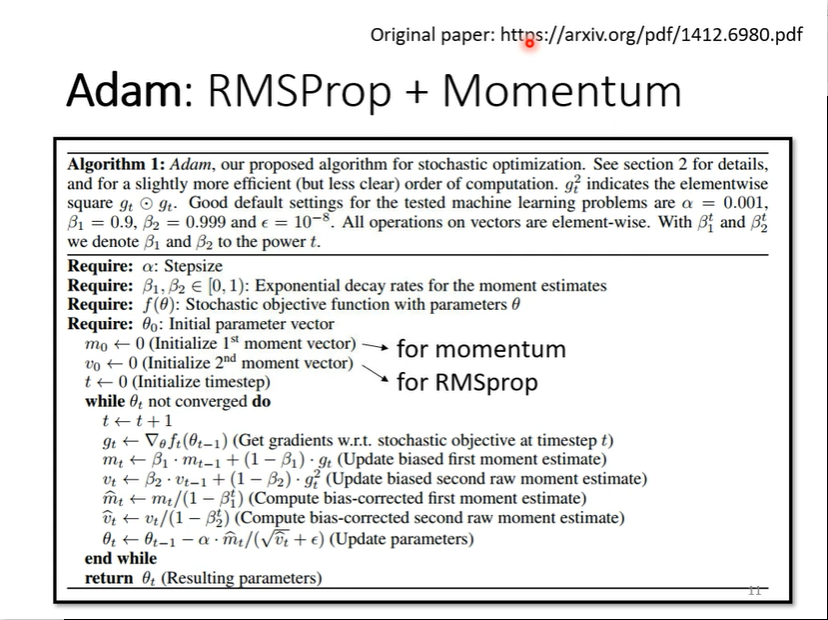
	- With Adaptive Learning Rate
	  collapsed:: true
		- 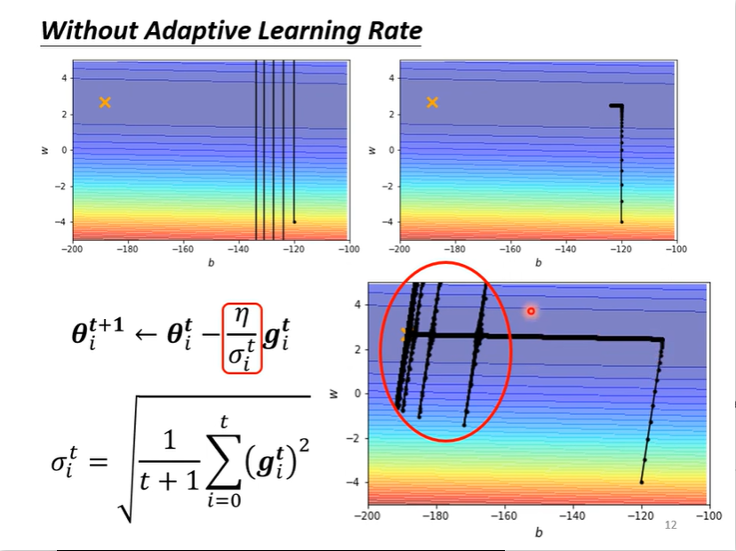
	- Learning Rate Scheduling
	  collapsed:: true
		- Learning rate Decay
		  collapsed:: true
			- 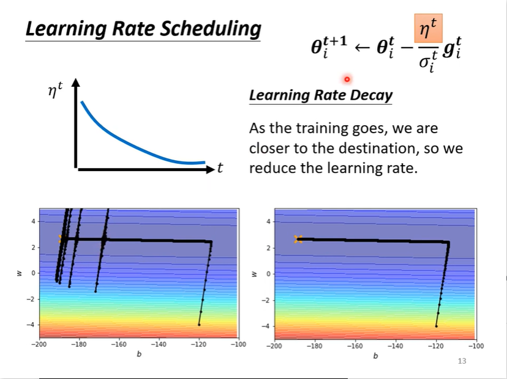
		- Warm Up (Learn more from RAdam)
		  collapsed:: true
			- Why? ()need to update around to get more information at the beginning)
				- 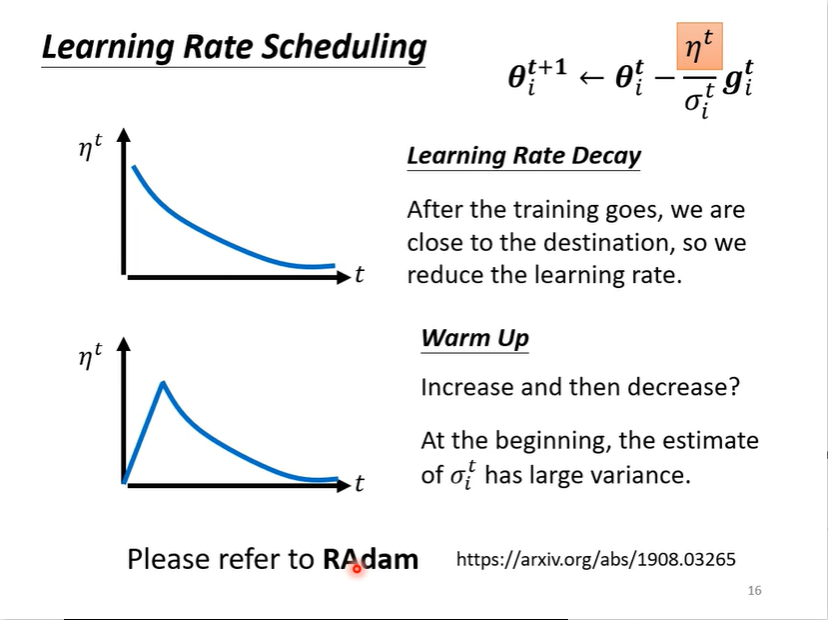
			- Have a long history
			  collapsed:: true
				- 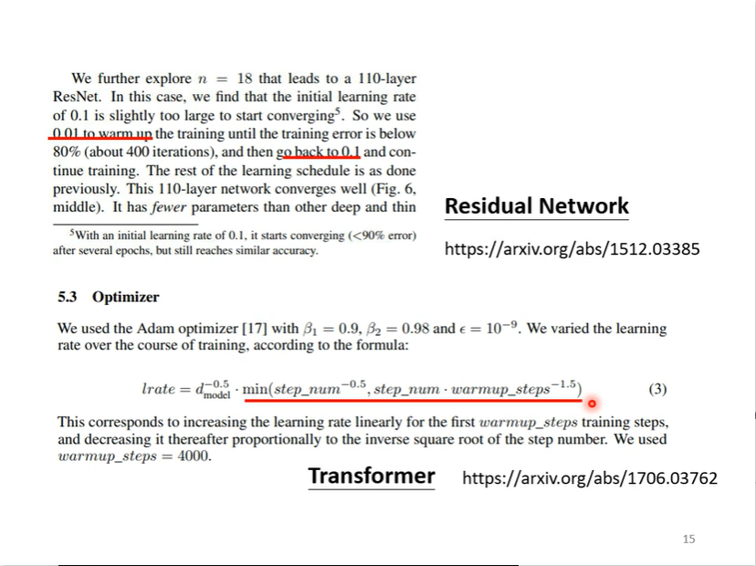
- # Summary of Optimization
  collapsed:: true
	- 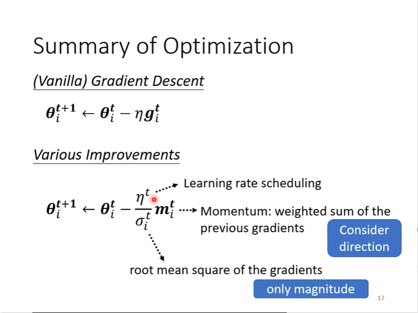
- # Learn more about optimization
  collapsed:: true
	- 
- # Change the error surface
	- 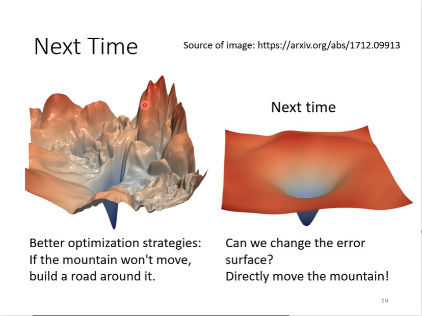