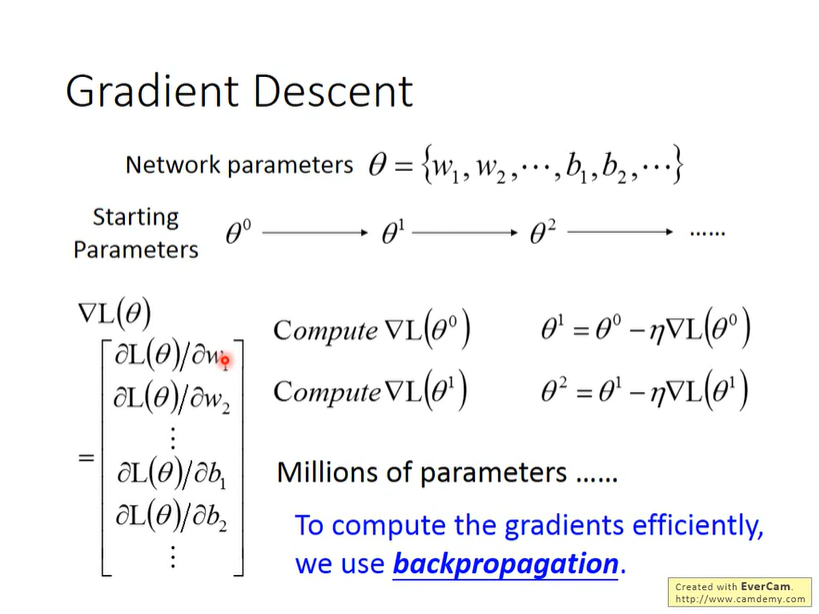
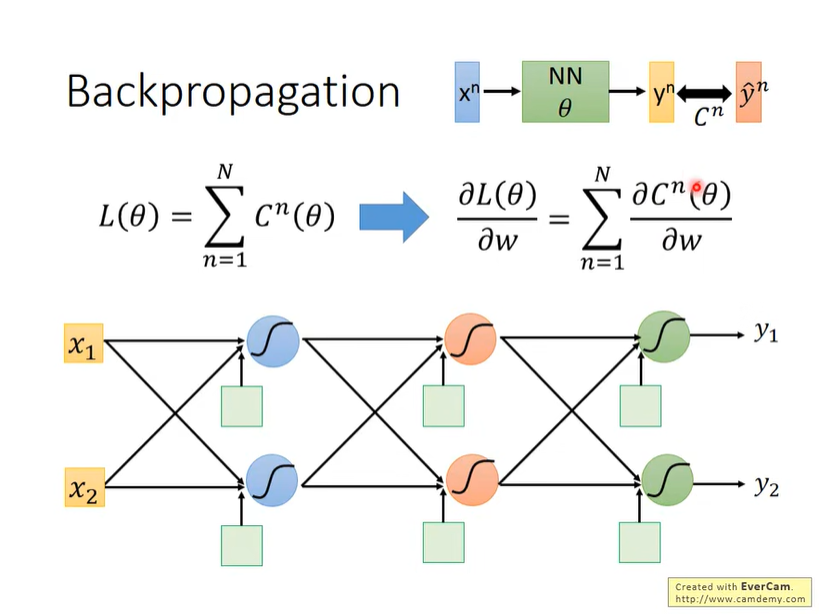
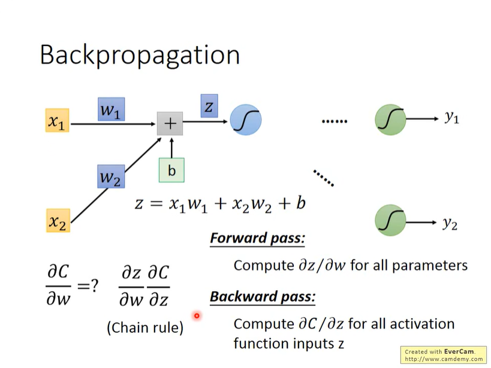
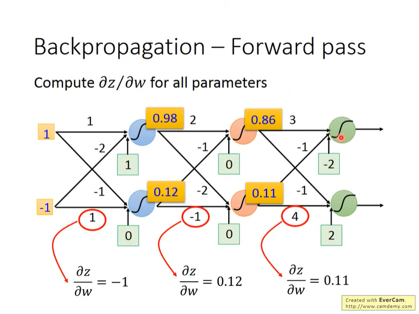
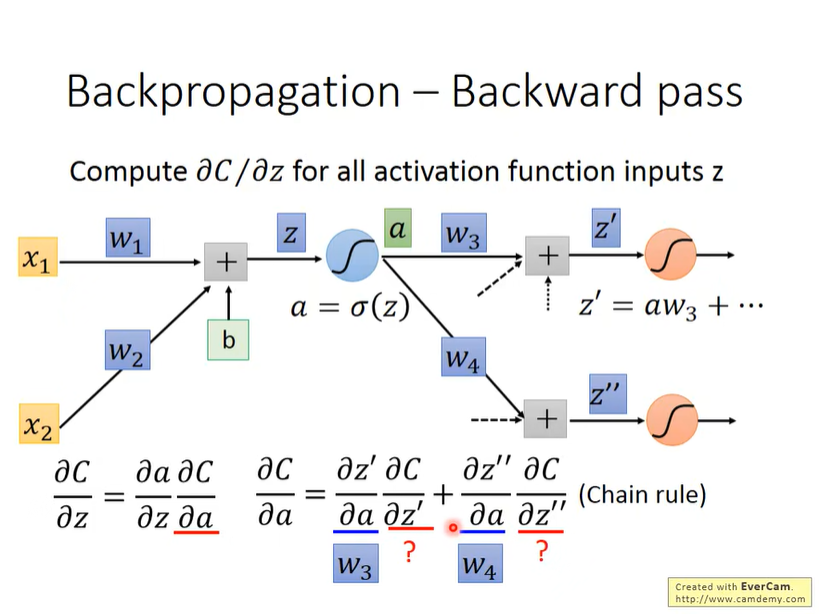
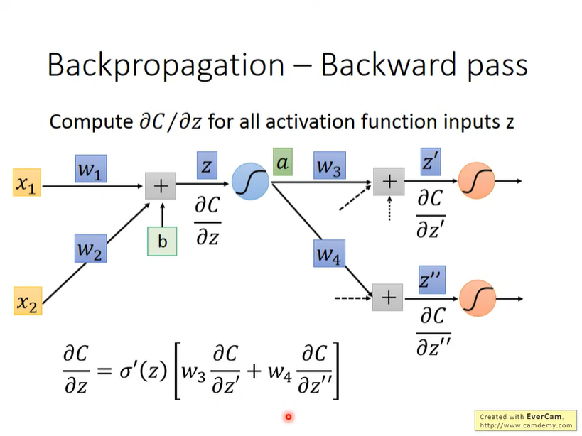
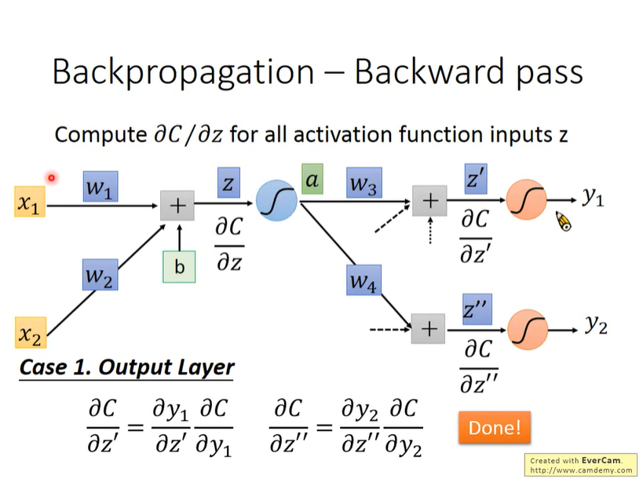
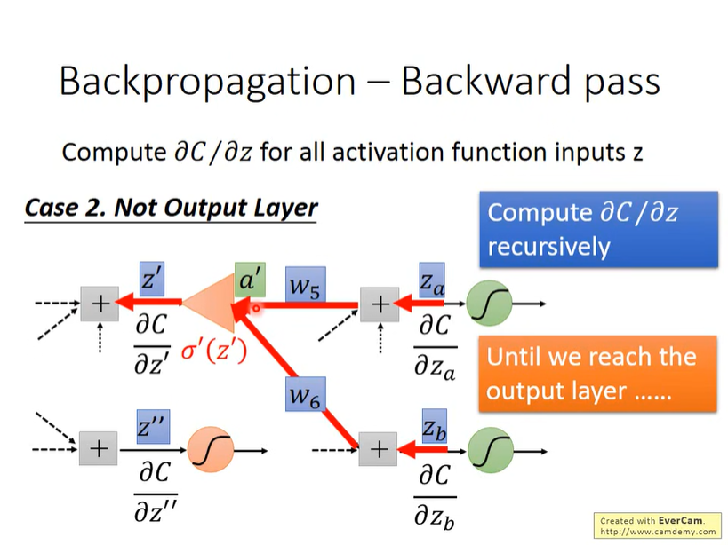
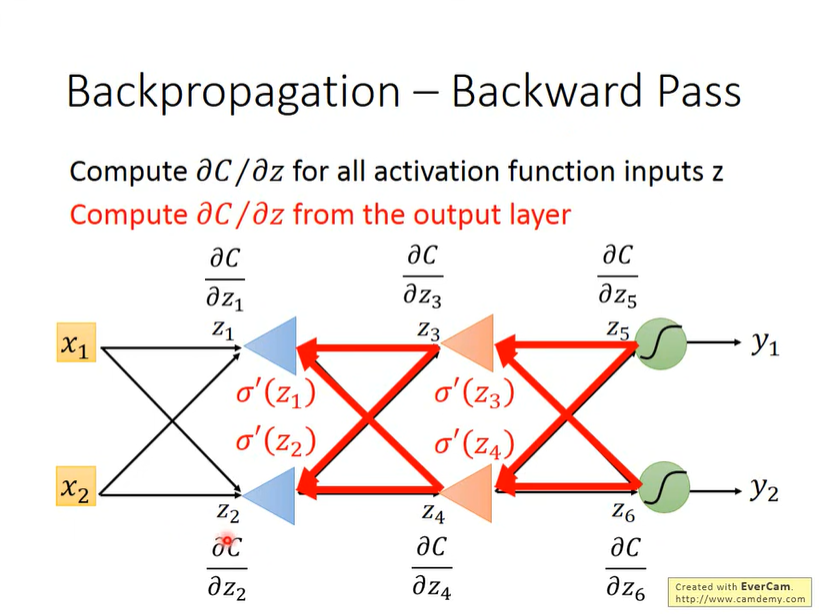

# Gradient Descent
collapsed:: true
	- There are millions of parameters. To compute the gradients efficiently, we use backpropagation.
		- 
- # Chain Rule
  collapsed:: true
	- examples
		- 
- # Backpropagation
  collapsed:: true
	- {:height 398, :width 520}
	- calculate partial
		- compute $$\frac{\partial C}{\partial w}$$, $$y$$ is the output layer neuron network output, $$a$$ is the output of hidden layer.
		  collapsed:: true
			- {:height 524, :width 689}
		- forward pass, compute $$\frac{\partial z}{\partial w}$$, this is very easy.
		  collapsed:: true
			-  
			  
		- backward pass, compute $$\frac{\partial C}{\partial z}$$
		  collapsed:: true
			- The $$a$$ affects $$C$$ through $$z^{'}$$ and $$z^{''}$$
			  collapsed:: true
				- 
				  
			- the above formula can be think in another view
			  collapsed:: true
				- 
			- case 1: only have one hidden layer
			  collapsed:: true
				- 
			- case 2
			  collapsed:: true
				- 
				  
				  