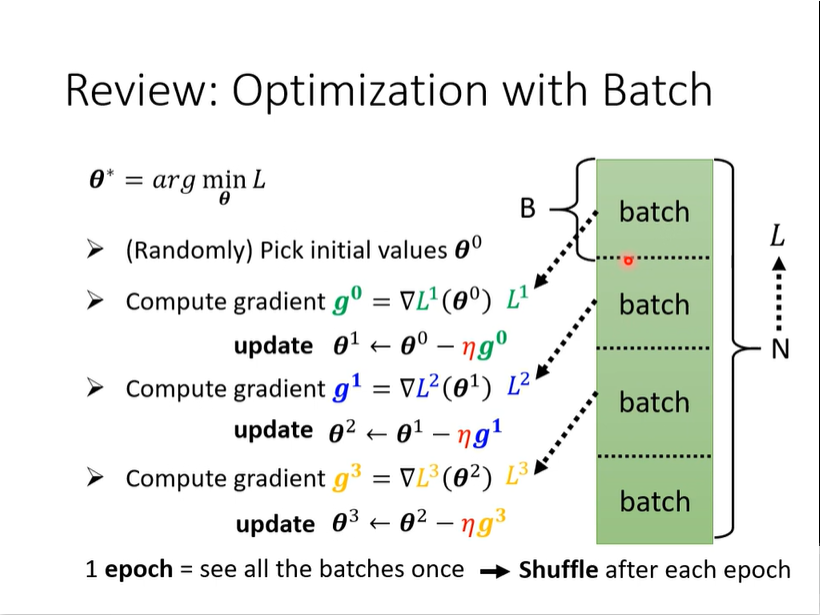

# Review
collapsed:: true
	- do the batch before epoch
	- 
- # Small Batch vs Large Batch
  collapsed:: true
	- Not parallel
	  collapsed:: true
		- 
	- Parallel operation situation
	  collapsed:: true
		- 
		- 
		- 
	- Small batch noisy help the training
	  collapsed:: true
		- experiment
		  collapsed:: true
			- 
		- why?
		  collapsed:: true
			- 
	- Small batch is better on testing data
	  collapsed:: true
		- experiment
		  collapsed:: true
			- 
		- Flat Minima and Sharp Minima (the test data and train data have different distribution)
		  collapsed:: true
			- 
			-
	- Comparison
	  collapsed:: true
		- 
- # Have both fish and bear's paw?
  collapsed:: true
	- 
- # Momentum
  collapsed:: true
	- Introduction
	  collapsed:: true
		- 
	- (Vanilla) gradient descent
	  collapsed:: true
		- 
	- Gradient Descent + Momentum
	  collapsed:: true
		- 
		- 
		- 
- # Concluding Remarks
  collapsed:: true
	- 