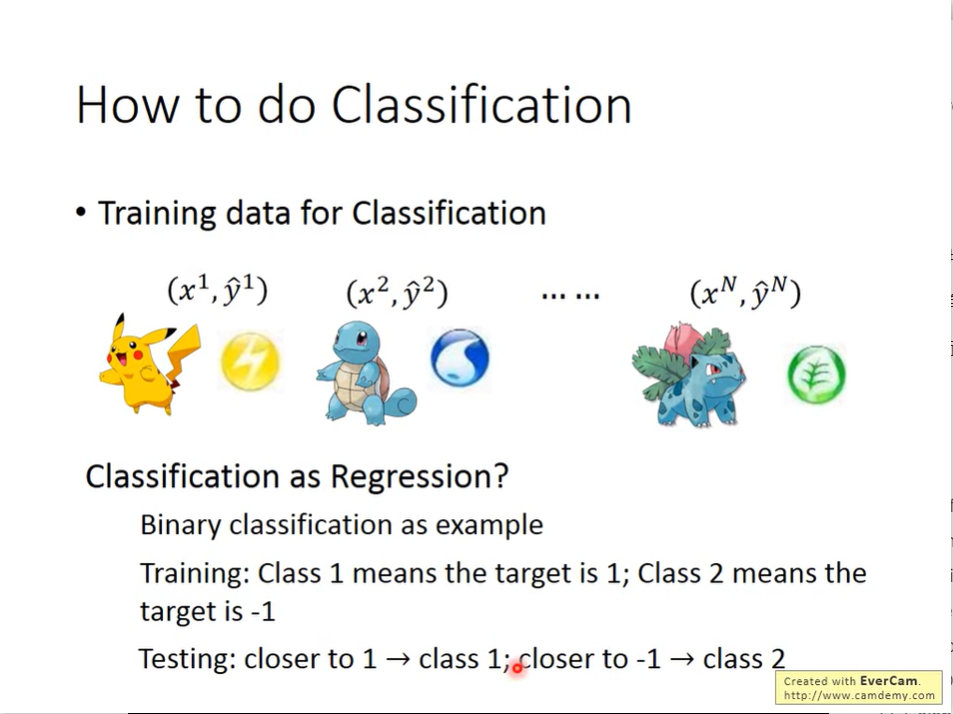
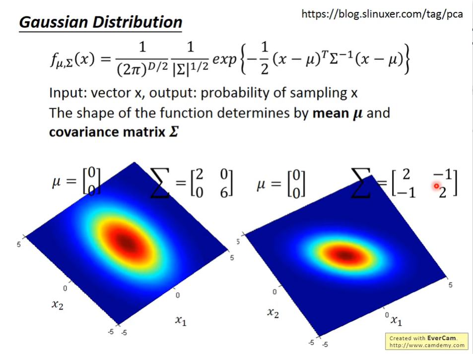

# Introduction
collapsed:: true
	- 
- # Example Application
  collapsed:: true
	- example introduction
	  collapsed:: true
		- 
		-
	- Features (use vector to describe them)
	  collapsed:: true
		- 
	- How to do Classification?
	  collapsed:: true
		- Classification as Regression (the function for the Regression is not suitable for Classification
		  collapsed:: true
			- 
			  
			-
		- ideal Alternatives
		  collapsed:: true
			- 
	- Two classes
	  collapsed:: true
		- introduction
			- Bayes formula
				- 
			-
		- Prior
		  collapsed:: true
			- 
		- Gaussian Distribution
		  collapsed:: true
			- 
			  
		- Probability from Class - Feature
		  collapsed:: true
			- 
			  
			- 
		- Maximum Likehood
		  collapsed:: true
			- 
			-
		- Now we can do classification
		  collapsed:: true
			- 
		- Example
		  collapsed:: true
			- 
			-
	- Modifying Model
	  collapsed:: true
		- different distribution can share the same  $$\sigma$$, and this operation can decrease the number of parameters. We can see the conclusion proof in the Ref: Bishop.
			- 
		- compare the results between the same $$\sigma$$ and different $$\sigma$$ ( the way to share the same $$\sigma$$ is Liner boundary )
		  collapsed:: true
			- 
	- Three steps
	  collapsed:: true
		- 
	- Probability Distribution
	  collapsed:: true
		- the different feature $$\sigma$$ is also important that can't be ignore.
		- 
	- Posterior Probability
	  collapsed:: true
		- Math warning
		  collapsed:: true
			- 
			- 
			- 
			- 
			-