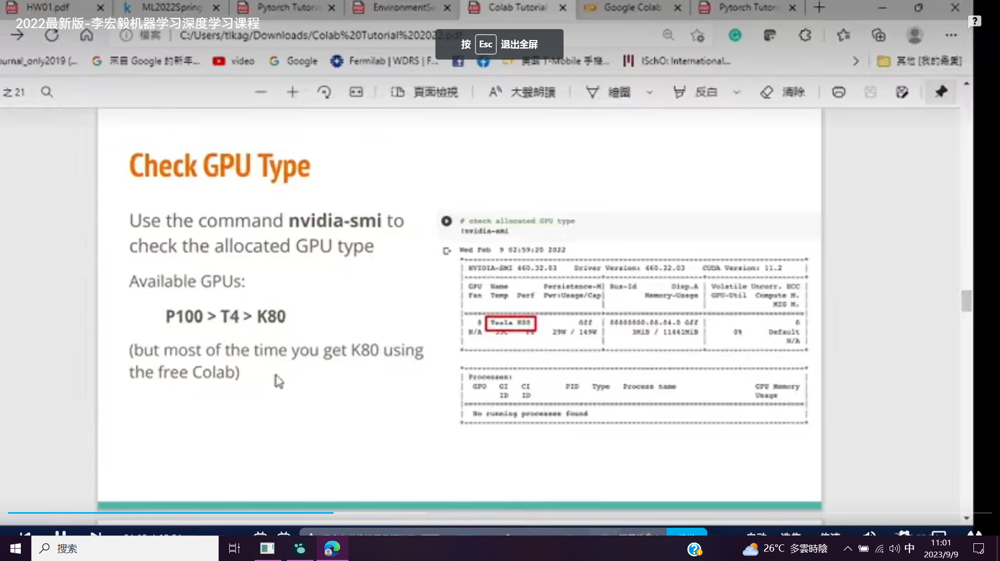
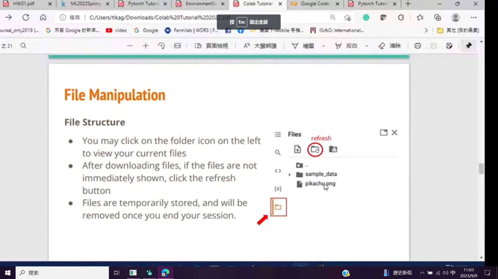

# Introduction
collapsed:: true
	- 
- # Geting Started
  collapsed:: true
	- 
	- There are two type in colab. if u want to use shell, u need to add a !.
		- 
	- to cd directory
		- 
- # Changing Runtime
  collapsed:: true
	- 
- # Executing Code Block
  collapsed:: true
	- 
- # Check GPU Type
  collapsed:: true
	- 
- # File Manipulation
  collapsed:: true
	- use gdown.
		- 
		  
- # Mounting Google Drive
  collapsed:: true
	- 
	   
	  
- # Saving Notebook
  collapsed:: true
	- 
- # Useful Linux Commands (in Colab)
  collapsed:: true
	- 
- # Problems You May Encounter
  collapsed:: true
	- 
- # Reference
	- 