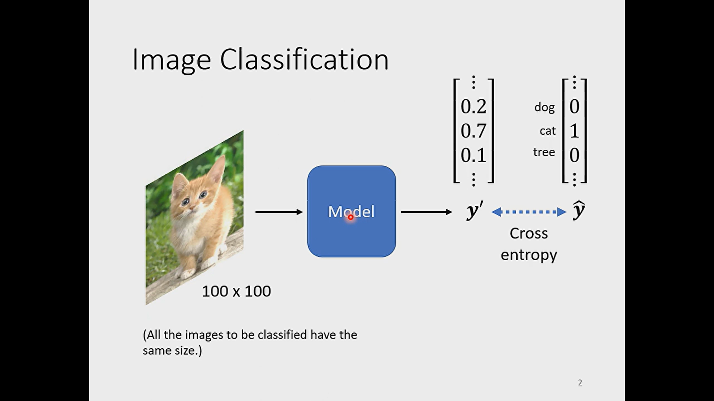
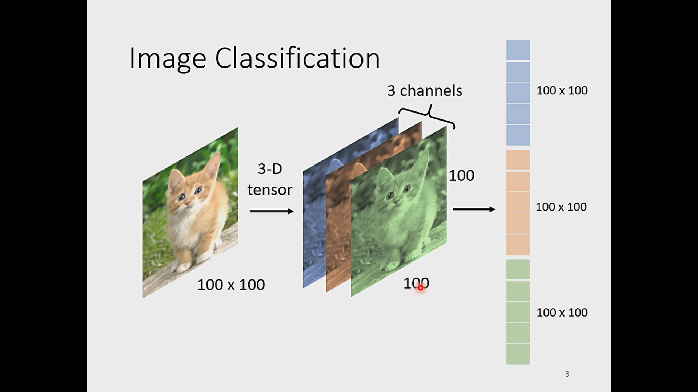
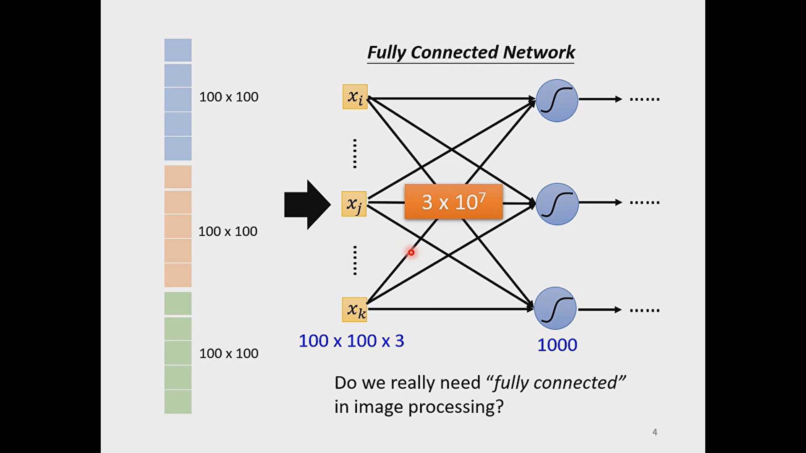
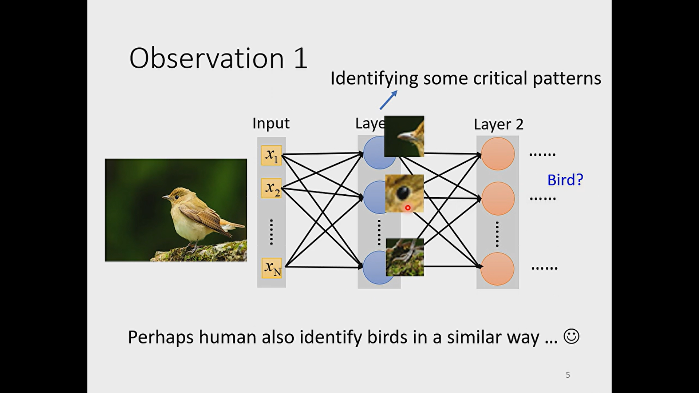
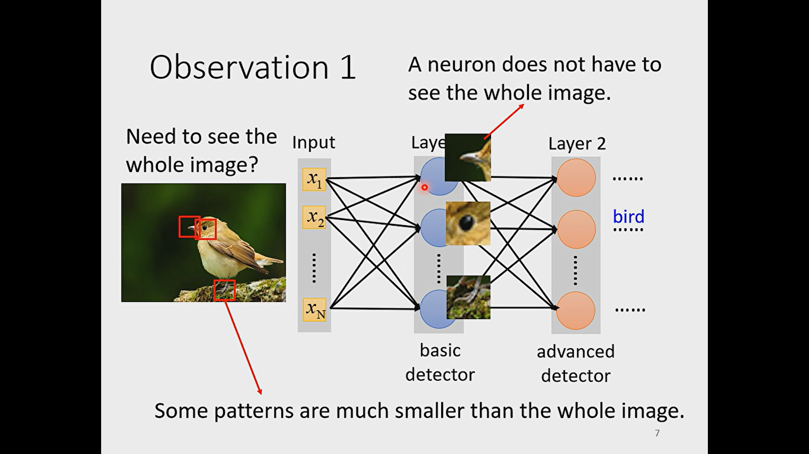
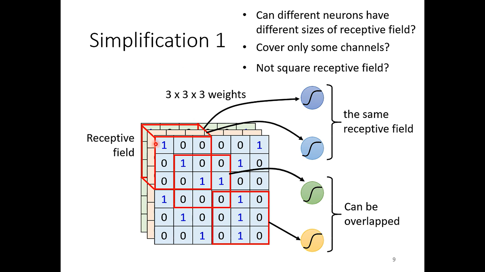
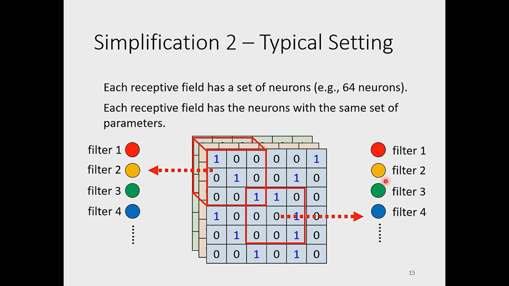

- Assuming a fixed image size
  id:: 656dbef6-97c9-4e45-8746-d69f176b812a
- when the image are in different sizes, we can resize them in the same size.
- # image classification
	- 
	- the image combine by three dimensions.
	- In order to input the image into machine model, we can flatten the 3d-tensor(image)
	- 
	- 
	- when the model weight increasing, the possibility of overfitting will increasing
	- maybe we don't need to use fully connected network, we just need to extract some special feature
	- 
	- 
	- 
	- can different neuro
	- 
	-
	-