- Assuming a fixed image size
  id:: 656dbef6-97c9-4e45-8746-d69f176b812a
- when the image are in different sizes, we can resize them in the same size.
- # image classification
  collapsed:: true
	- 
	- the image combine by three dimensions.
	- In order to input the image into machine model, we can flatten the 3d-tensor(image)
	- 
	- 
	- when the model weight increasing, the possibility of overfitting will increasing
	- maybe we don't need to use fully connected network, we just need to extract some special feature
	- 
	- 
	- 
	- can different neurons have different sizes of receptive field?
	- cover only some channels? no, some feature only appear in red(or green, blue) channel
	- not square receptive field?
	- 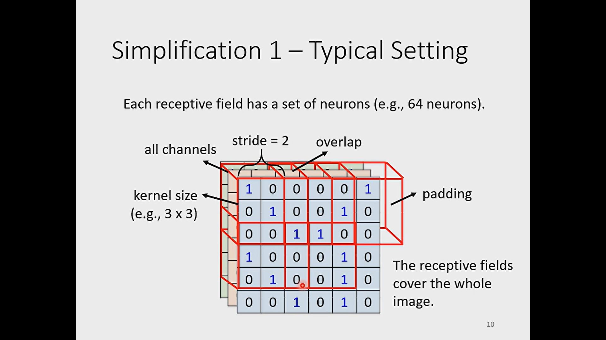
	- consider all channels, stride, padding
	- 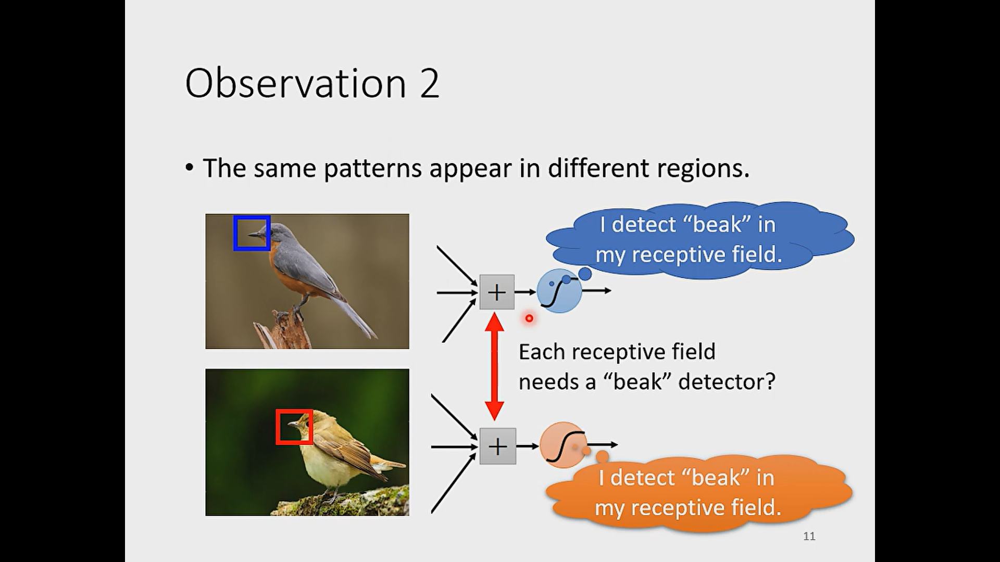
	- each receptive field needs a "beak" detector? no, we can use share parameters
	- 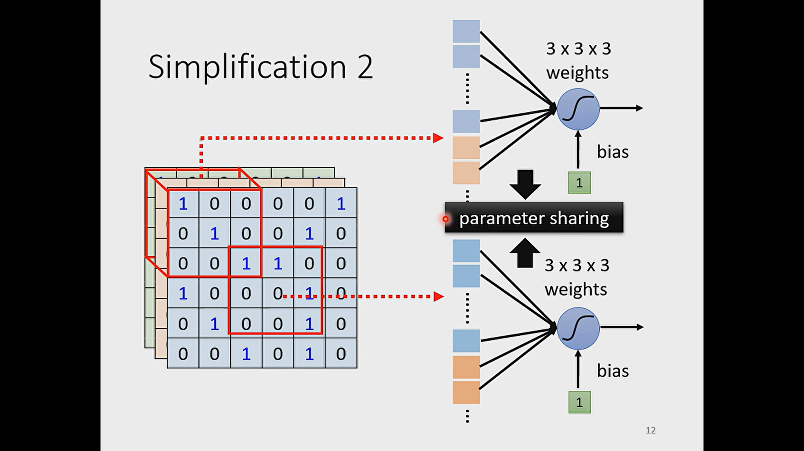
	- 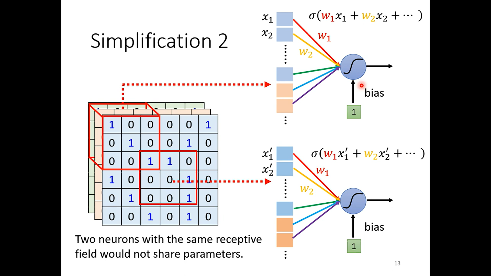
	- 
	- 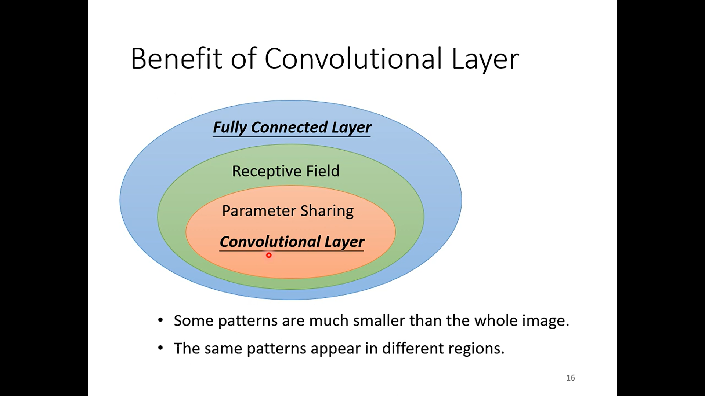
	- The above way use in image recognition will have low model bias. When we use cnn in other task, we need to consider if the pattern satisfy the above mode
- # Another story about convolutional neural network
  collapsed:: true
	- 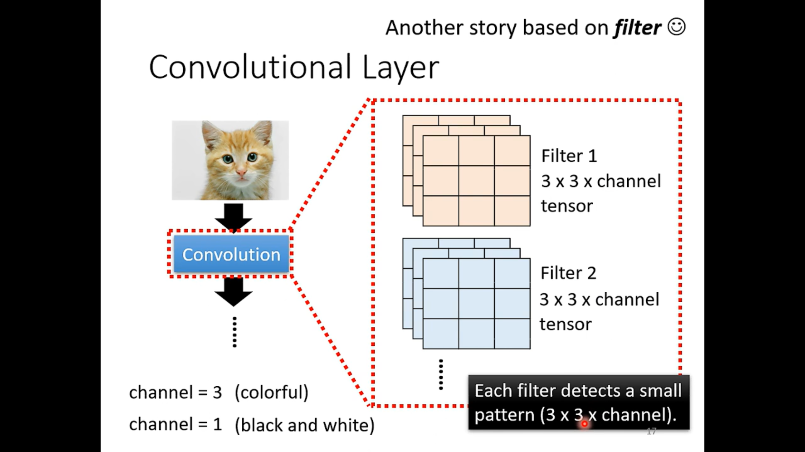
	- 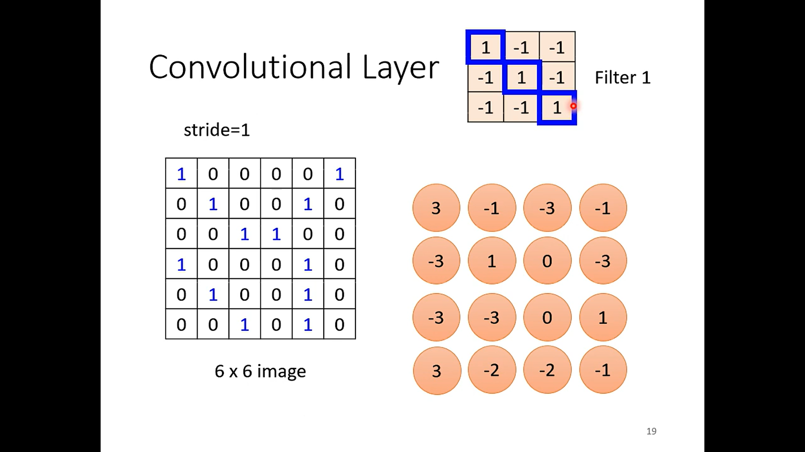
	- use filter to do the inner product
	- 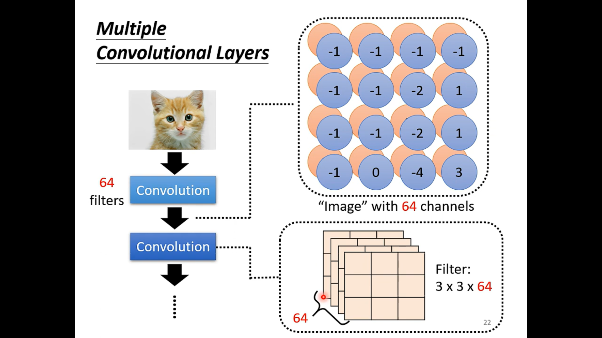
	- 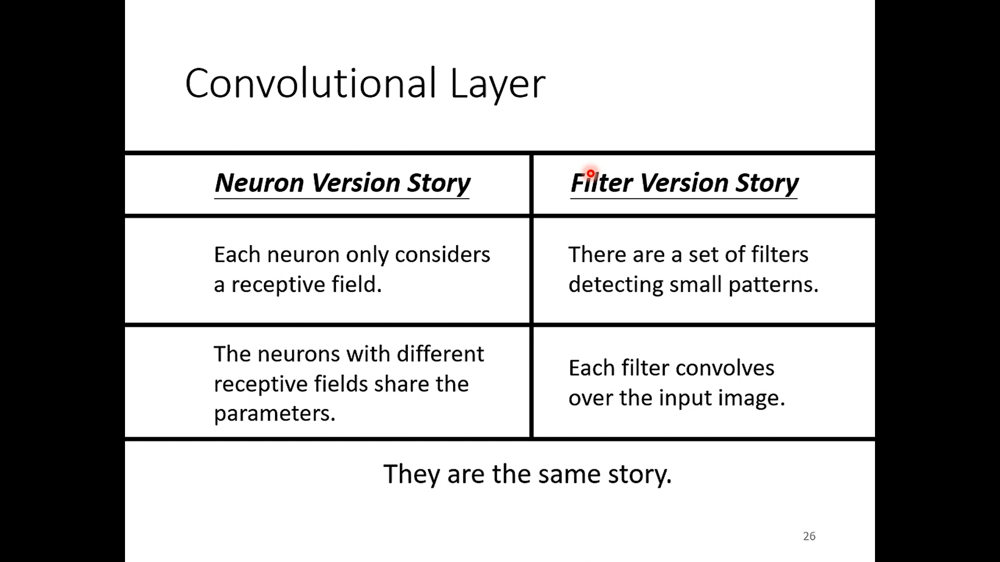
- # Pooling
  collapsed:: true
	- 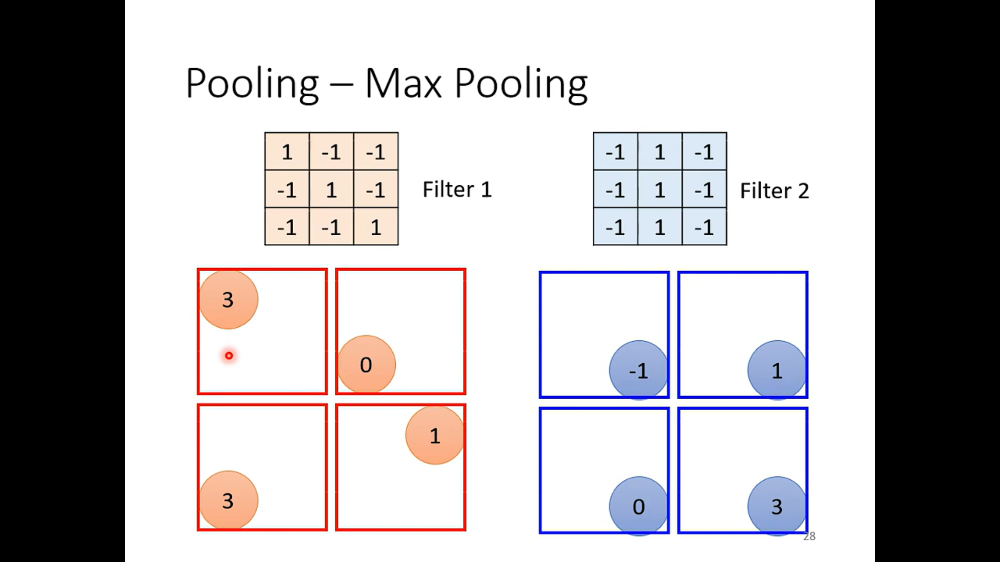
	- pooling functions is to small the image(pool don't have parameters)
	- 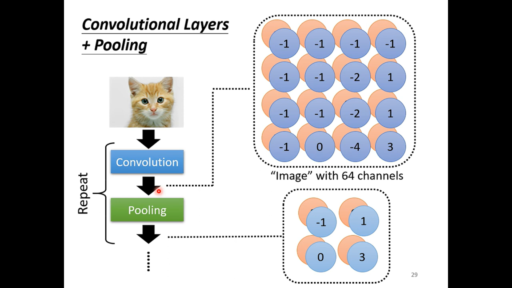
	- ^^Notice^^: the pooling may also hurt the final model performance
	- 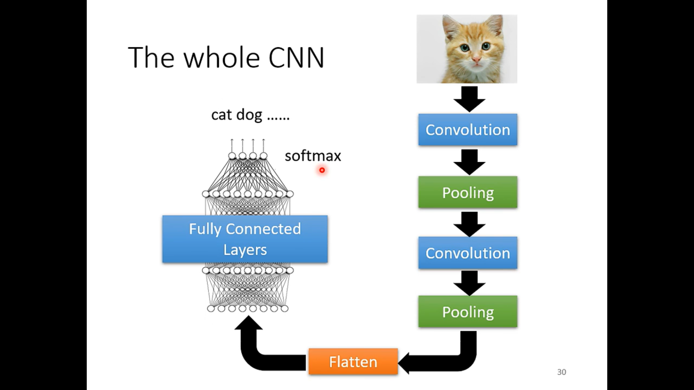
	-
- # Application: Playing Go
	- 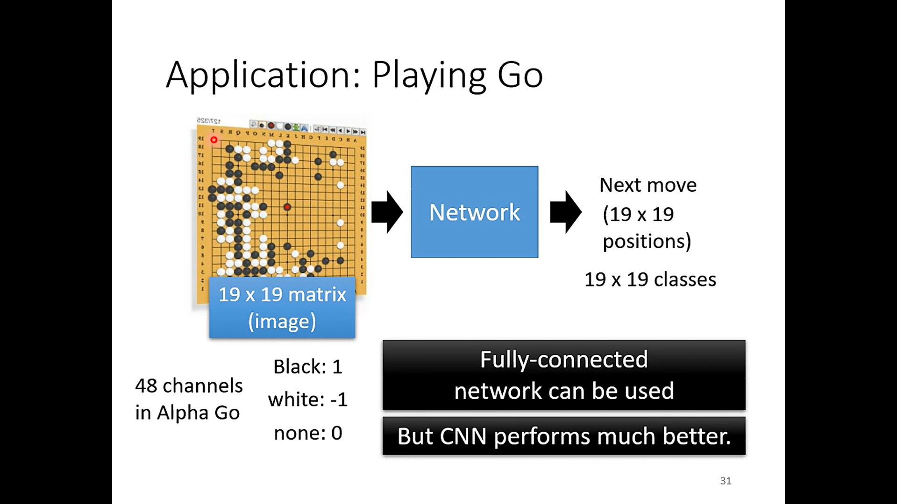
	- the 48 channels come from domain knowledge. The expert use 48 numbers to describe the chess piece. it can be found in Alphago Paper
	  id:: 656de37f-579b-4208-b819-2ad14db5b2ba
	- 
	- 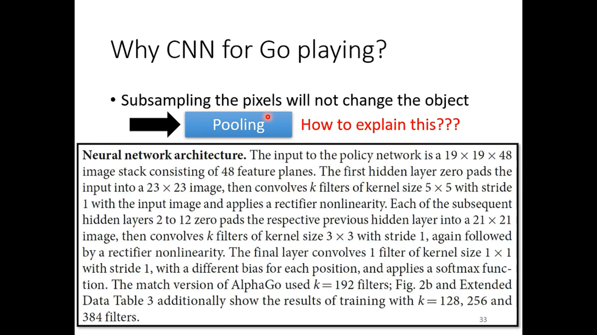
	-