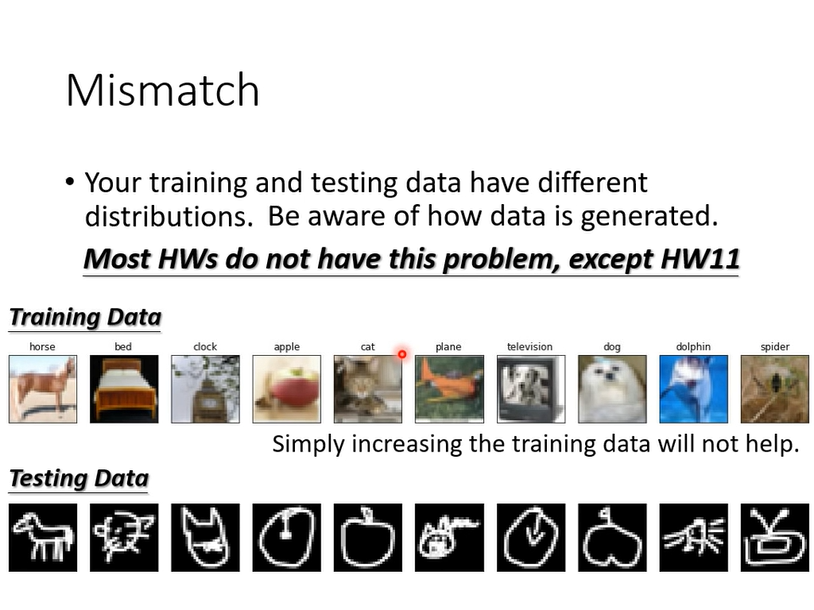

# Framework of ML
	- Introduction
	  collapsed:: true
		- 
	- How
	  collapsed:: true
		- 
		-
- # General Guide
	- Introduction
	  collapsed:: true
		- 
	- Model bias
	  collapsed:: true
		- 
	- Optimization issue
	  collapsed:: true
		- issue
		  collapsed:: true
			- 
		- solve
		  collapsed:: true
			- 
	- Which one? (Model Bias, Optimization)
	  collapsed:: true
		- introduction
			- We must record the train loss to check if it's optimization issue.
			- 
		- Model Bias vs Optimization Issue
		  collapsed:: true
			- 
	- Overfitting
	  collapsed:: true
		- introduction
		  collapsed:: true
			- 
			-
		- why?
		  collapsed:: true
			- 
		- how?
		  collapsed:: true
			- Way 1:
			  collapsed:: true
				- 
			- Way 2:
			  collapsed:: true
				- 
			- Notice:
			  collapsed:: true
				- 
				- 
		- select model
		  collapsed:: true
			- wrong way:
			  collapsed:: true
				- 
			- right way:
			  collapsed:: true
				- 
			- N-fold Cross Validation
				- 
	- Mismatch
	  collapsed:: true
		- 
	-