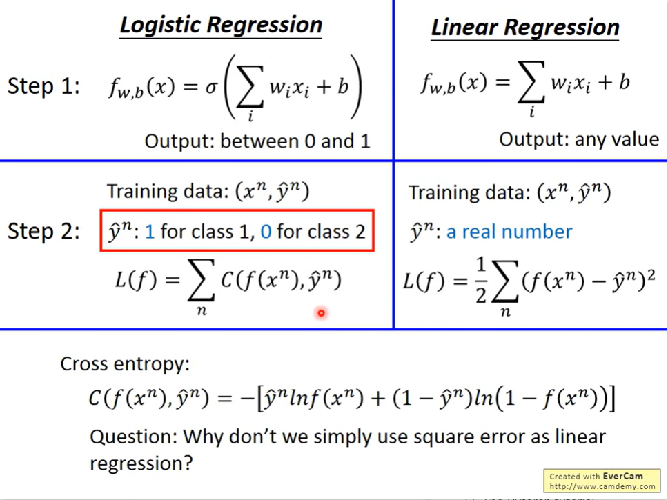
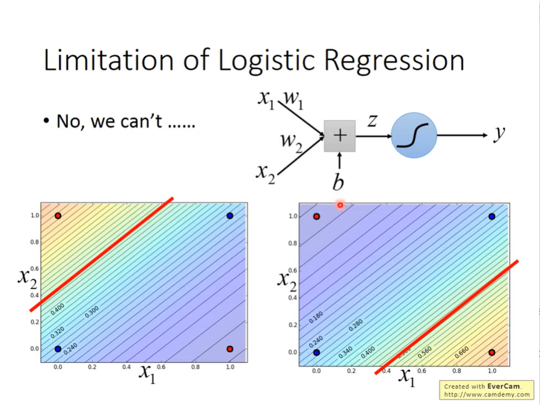

- Three steps
	- Step 1 :
	  collapsed:: true
		- 
		- 
	- Step 2:
	  collapsed:: true
		- 
		- 
		- 
	- Step 3:
	  collapsed:: true
		- 
		- 
	- Compare the Logistic regression with the liner regression
	  collapsed:: true
		- The $$C$$ means cross function
		  collapsed:: true
			- 
		- three steps comparison
		  collapsed:: true
			- 
- Logistic Regression + Square Error
  collapsed:: true
	- 
	- 
	-
- Discriminative vs Generative
  collapsed:: true
	- 
	- 
	- 
- Multi-class Classification
  collapsed:: true
	- 
	- 
	-
- Limitation of Logistic Regression
  collapsed:: true
	- Logistic Regression boundary is line
	  collapsed:: true
		- 
	- Use Feature Transformation
	  collapsed:: true
		- 
	- Cascading logistic regression models
		- 
		- 