- There are **fifteen lectures** in this course. Maybe I can finished this course in the weekend.
- This course focuses on **Deep Learning**
- Machine Learning : just find a function
  collapsed:: true
	- 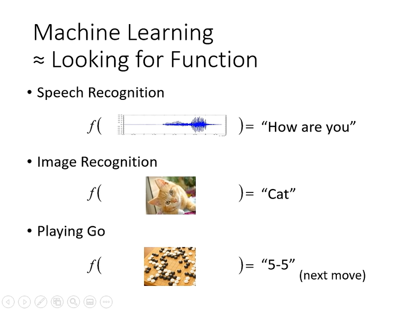
- Machine Learning: Deep learning
  collapsed:: true
	- input: vector, matrix, sequence
	- output: regression, classification, image, text
	- 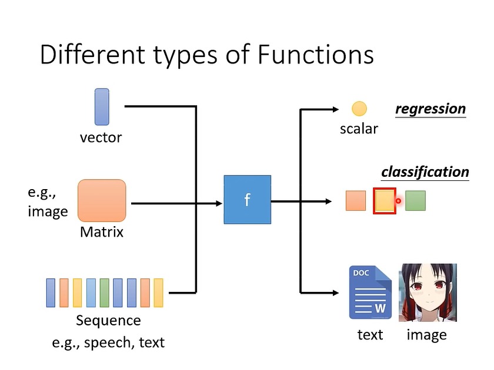
- # Lecture 1-5 Supervised Learning
	- ## Introduction
	  collapsed:: true
		- ## What need?
			- Training data(The datas need **labels**)
			- 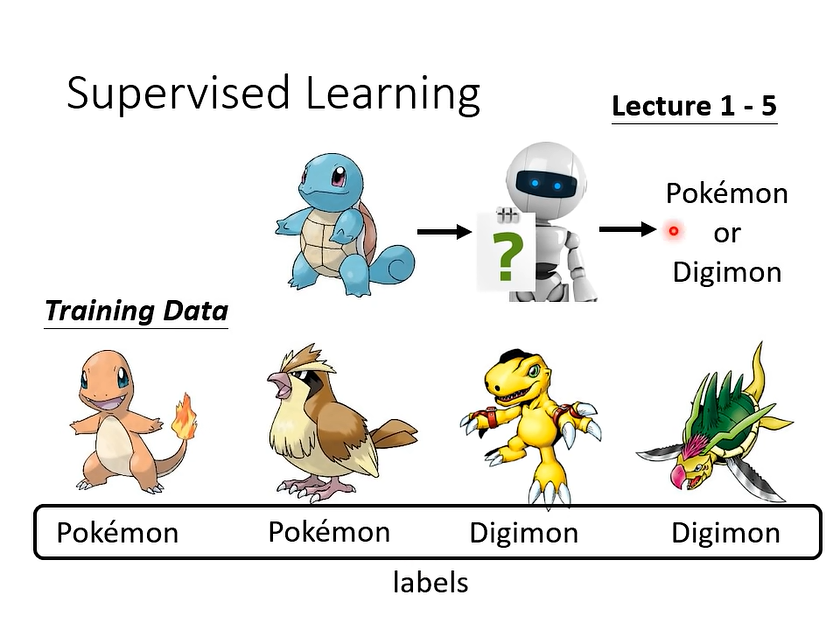
		- ## The disadvantages
			- It's **not efficient** to collect data for each task.
	- ## Notes
		- [[The introduction of machine learning(Deep learning)]]
		- [[The Pytorch tutorial - 1 (Introduction)]], [[The Pytorch Tutorial - 2 (examples)]]
		- [[Colab Tutorial]]
		- [[The Deep learning introduction]]
		- [[Backpropagation]]
		- [[Regression]]
		- [[Classfication (Naive Bayes Classifier)]]
		  collapsed:: true
		- [[Logistic Regression]]
		- [[General Guidance]]
		- [[When gradient is small... (Optimization Issue)]]
		- [[Batch and Momentum]]
		- [[Adaptive Learning Rate]]
		- [[Loss function may affect the network train]]
		- [[Talk about the fundamentals of machine learning]]
		- [[Gradient Descent]]
		- [[Convolutinal Neural Network(CNN)]]
		- [[Why deep learning?]]
		- [[Validation and Overfitting]]
		- [[Spatial Transformer Layer]]
		-
- # Lecture 7: Self-supervised Learning
  collapsed:: true
	- ## Develop general purpose knowledge(**Pre-train**)
		- ## Just learn that the basic skills
			- ### How to do the above things?
				- For example, Invert or discolor an image and give this data to the machine and then ask it if they are same. When the machine can tell the difference between the unchanged images and the changed images, this machine can be good at the another more complicated task(^^downstream tasks^^), such as tell the different kinds of items.
	- ## Pre-trained Model(Foundation Model) vs Downstream Tasks
		- The foundation model: Bert
- # Lecture 6: Generative Adversarial Network
  collapsed:: true
	- you don't need to find the paired data. The GAN can find the relationship of the data.
		- 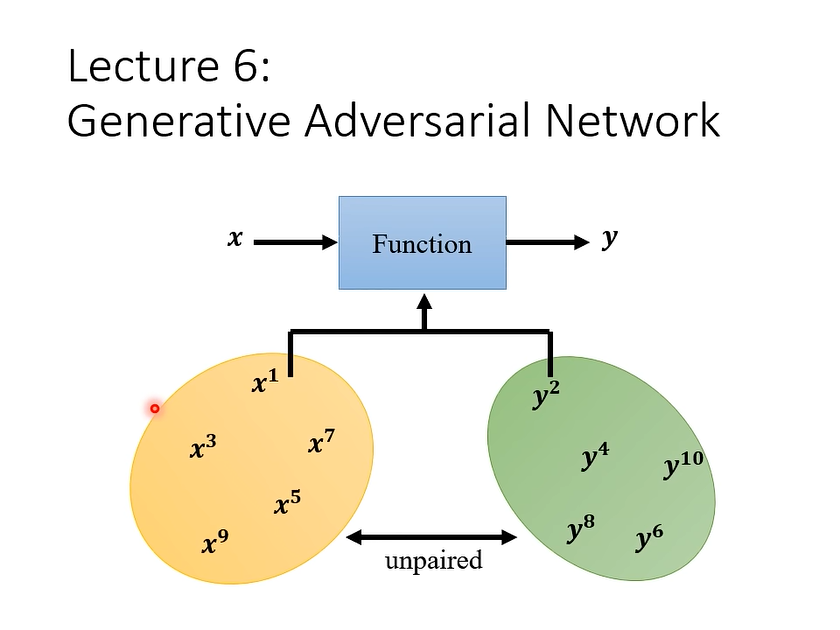
		- 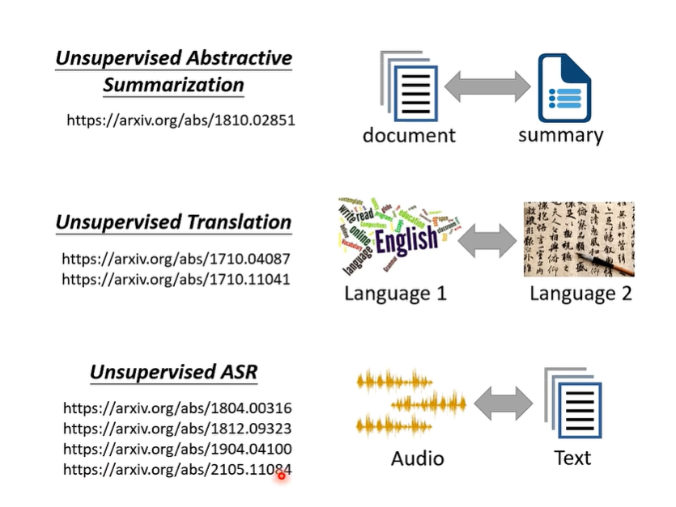
- # Lecture 12 Reinforcement Learning(RL)
  collapsed:: true
	- When u deal with how to label the data, you can you use ^^reinforcement learning^^. For example, it's very difficult for us to label the go competition data.
- # Lecture 8: Anomaly Detection
  collapsed:: true
	- To make machine to have the ability to **answer he don't know.**
	- 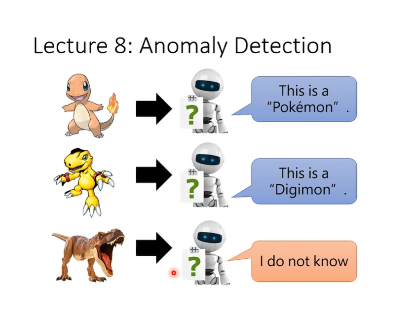
- # Lecture 9: Explainable AI
  collapsed:: true
	- Just let the machine tell me do these results. As the follow second image, that will tell me use this skill to find the bugs, such as png and jepg???(lol)
		- 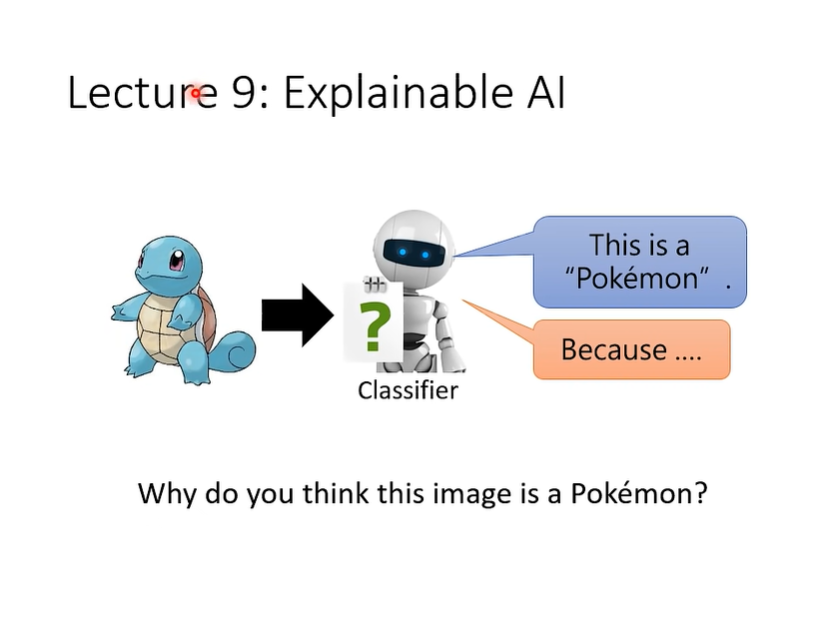
		- 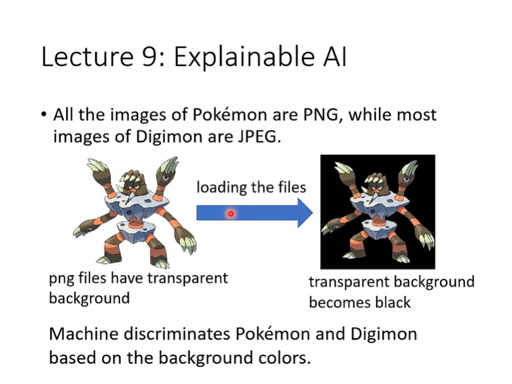
		-
- # Lecture 10：Model Attack: Model Attach
- # Lecture 11: Domain Adaptation
  id:: 64f9f204-ef46-4436-ac48-93bdab19ae51
  collapsed:: true
	- As u know, the training data and the test data have the same distribution. The customer probably won't give the same distributions data, just like the follow image displaying.
		- 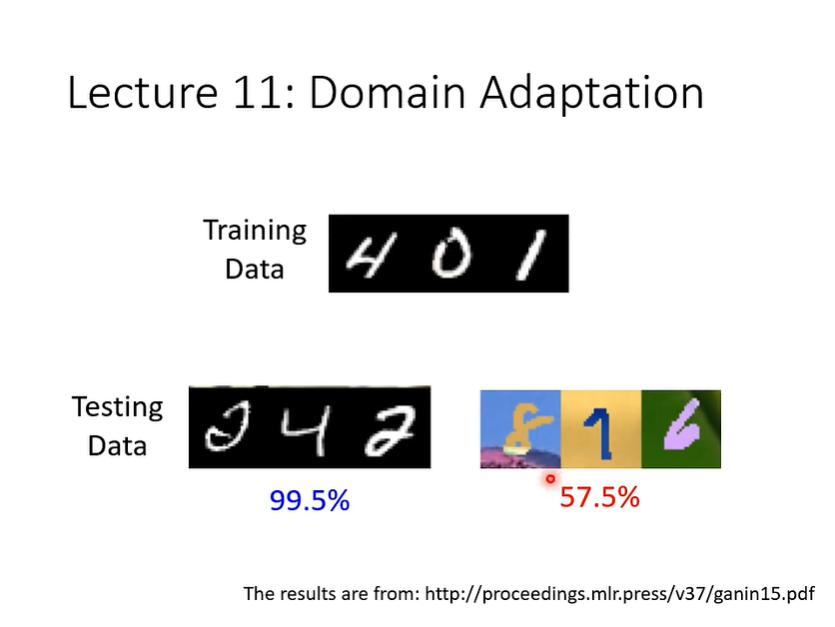
- # Lecture 13: Network Compression
  collapsed:: true
	- 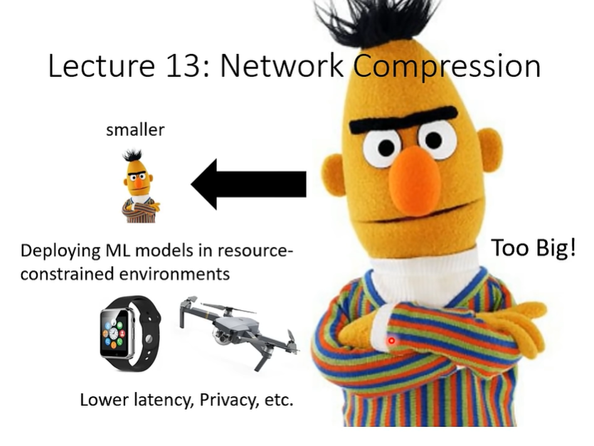
- # Lecture 14: Life-long Learning
  collapsed:: true
	- 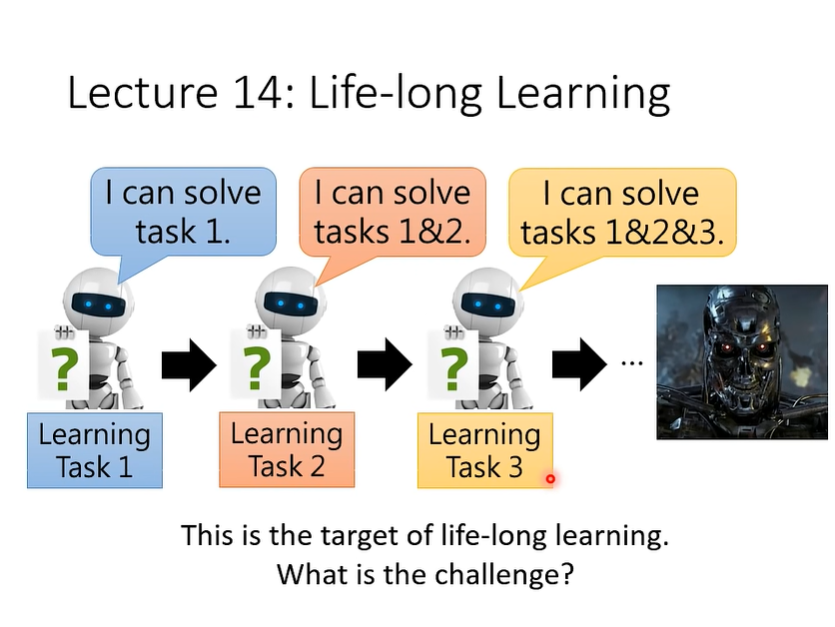
- # Lecture 15: Meta-Learning(Few shot learning)
  collapsed:: true
	- Make the machine how to learn
	- 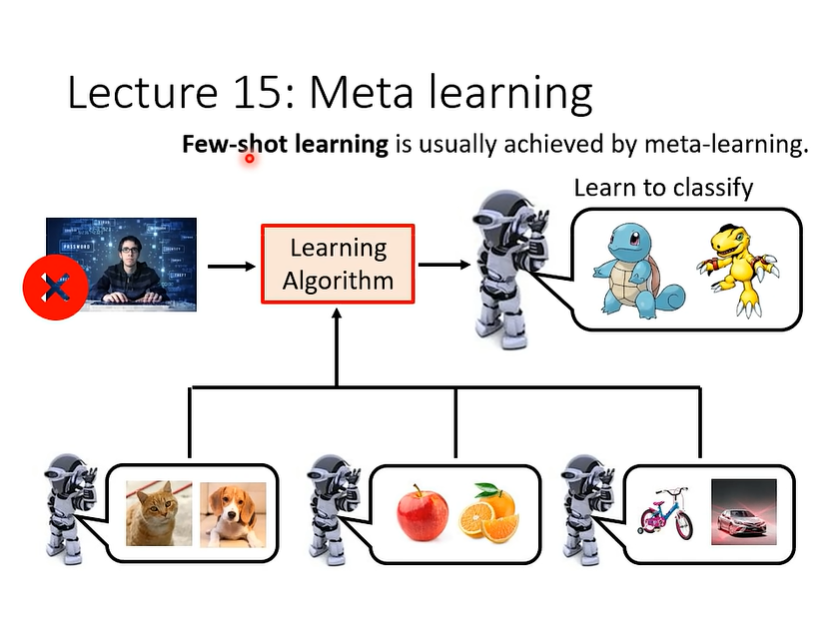
	-