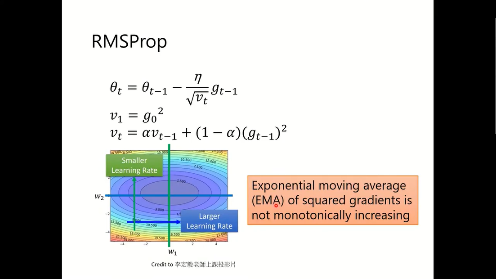
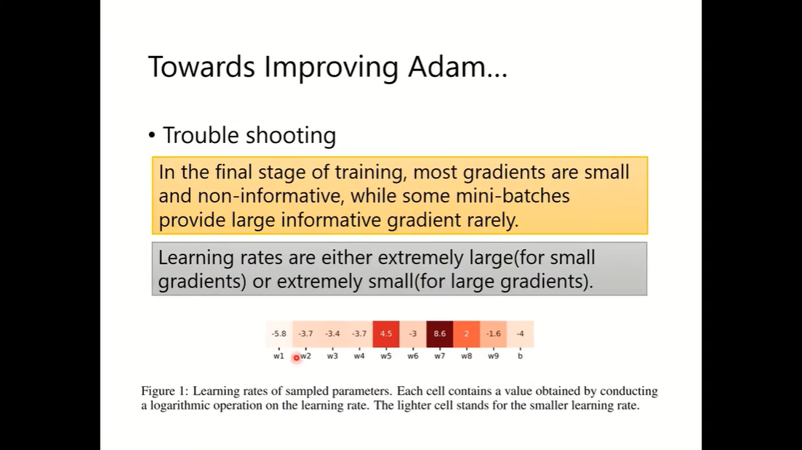

# What you have known before?
collapsed:: true
	- 
- # Some Notations
  collapsed:: true
	- 
- # What is optimization about?
  collapsed:: true
	- 
- # On-Line vs Off-Line
  collapsed:: true
	- 
- # Optimizers
  collapsed:: true
	- SGD
	  collapsed:: true
		- 
	- SGD with Momentum (SGDM)
	  collapsed:: true
		- 
		- 
	- Adagrad
	  collapsed:: true
		- 
	- RMSProp
	  collapsed:: true
		- 
	- Adam
	  collapsed:: true
		- 
	- Why Momentum?
	  collapsed:: true
		- 
- # Optimizers: Real Application
  collapsed:: true
	- Bert, Tacotron, Transformer
	  collapsed:: true
		- 
	- YOLO, Mask R-CNN, ResNet
	  collapsed:: true
		- 
	- Big GAN, MAML (MEMO)
	  collapsed:: true
		- memo can learn something quickly
		  collapsed:: true
			- 
- # Adam vs SGDM
  collapsed:: true
	- 
	- 
	- 
	- 
	- 
	-
- # Simply combine Adam with SGDM
  collapsed:: true
	- 
- # Towards Improving Adam
  collapsed:: true
	- Trouble
	  collapsed:: true
		- 
		- 
	- Solve
	  collapsed:: true
		- Way 1:
		  collapsed:: true
			- 
			-
		- Way 2:
		  collapsed:: true
			- 
			- 
- # Towards Improving SGDM
  collapsed:: true
	- Trouble
	  collapsed:: true
		- 
	- Try to find a learning rate (do a experiment)
	  collapsed:: true
		- 
	- Cyclical LR
	  collapsed:: true
		- 
	- SGDR
	  collapsed:: true
		- 
	- One-cycle LR
	  collapsed:: true
		- 
- # Does Adam need warm-up?
  collapsed:: true
	- Conclusion
	  collapsed:: true
		- 
	- Another way
		- 
	- RAdam
	  collapsed:: true
		- 
- # RAdam vs SWATS
  collapsed:: true
	- 
- # K step forward, 1 step back
  collapsed:: true
	- How?
	  collapsed:: true
		- 
	- results
	  collapsed:: true
		- 
	-
- # More than momentum...
  collapsed:: true
	- run from the right at the beginning
	  collapsed:: true
		- 
- # Can we look the future?
  collapsed:: true
	- What?
	  collapsed:: true
		- 
		- 
	- Math warning to prove if we need to maintain two parameters?
		- 
- # Adam in the future (Nadam)
  collapsed:: true
	- 
- # Do you really  know your optimizer?
  collapsed:: true
	- A story of regularization
	  collapsed:: true
		- 
	- use the follow way, regularization won't affect the $$v_t$$ and $$m_t$$
	  collapsed:: true
		- 
	- ^^L2 regularization or weight decay^^ (the most practical trick in this page)
	  collapsed:: true
		- 
	-
- # Something helps optimization
  collapsed:: true
	- 
	- 
	- 
- # What we learned today?
  collapsed:: true
	- 
	- 
- # Advices
  collapsed:: true
	- 
- # Universal Optimizer
  collapsed:: true
	- 
- [选修-深度学习新的优化器-2_哔哩哔哩_bilibili](https://www.bilibili.com/video/BV1m3411p7wD?p=21&spm_id_from=pageDriver&vd_source=4509a4938eb6aed461dbcca76232f0dc)