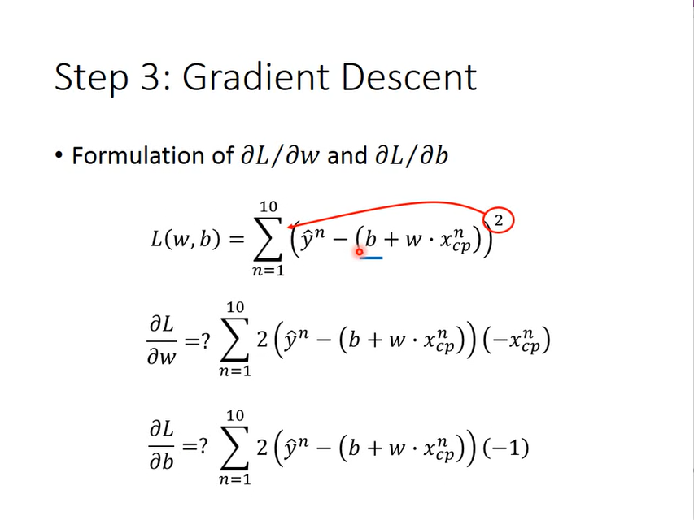

# The Application
collapsed:: true
	- 
	-
- # Example Application
	- The task introduction
	  collapsed:: true
		- 
	- Step 1: Model
	  collapsed:: true
		- 
	- Step 2: Goodness of Function
	  collapsed:: true
		- 
		  
		  
		- The color is more red, the function is more worse.
		  collapsed:: true
			- 
	- Step 3: Best Function ( Use gradient to choose it.  )
	  collapsed:: true
		- Gradient descent can solve all differentiable functions.
		  collapsed:: true
			- 
		- The gradient descent solve detail.
		  collapsed:: true
			- {:height 421, :width 551}
			  
			-
		- local minmnum ( but this don't happen on regression )
		  collapsed:: true
			- 
		- How about two parameters?
		  collapsed:: true
			- 
		- Featured gradient descent
		  collapsed:: true
			- 
		- Worry?
		  collapsed:: true
			- 
		- Formulation of $${\partial L}/{\partial w}$$ and $${\partial L}/{\partial b}$$
		  collapsed:: true
			- 
	- How's the results?
	  collapsed:: true
		- Generalization
		  collapsed:: true
			- 
		- Selecting another model (to get more better results)
		  collapsed:: true
			- 
			  
			  ...
			  
			-
		- Model selection
			- train data error
			  collapsed:: true
				- 
			- test data error (^^Overfitting^^)
			  collapsed:: true
				- 
	- What are the hidden factors?
	  collapsed:: true
		- 
	- Back to step 1: redesign the model (need the domain knowledge)
		- example
		  collapsed:: true
			- 
			  
			-
		- results
		  collapsed:: true
			- 
		- Any there any other hidden factors?
		  collapsed:: true
			- 
		- don't have domain knowledge, can put all feature
		  collapsed:: true
			- 
	- Back to step 2: regularization
		- not need to consider bias, because the bias just affect  the the function curve moving up and down. Regularization can make the model more robust. avoid overfitting, decrease the test error. the $$w_i$$ more near 0, the smaller function's input impact on the output.
			- 
			  
		-
- # Conclusion & Following Lectures
	- the error will higher the test on class (Overestimate) . can be explain in validation.
		- 
	-
-