# Introduction( what is input? )
collapsed:: true
	- word input
	- 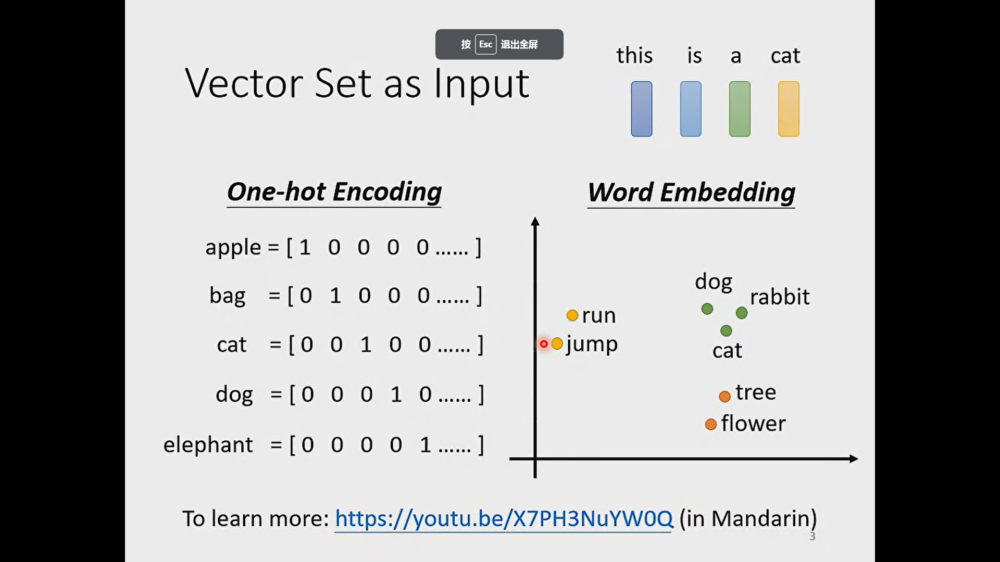
	  id:: 657139b9-d436-46bf-a7a3-e21a16de0a23
	- audio input
	- 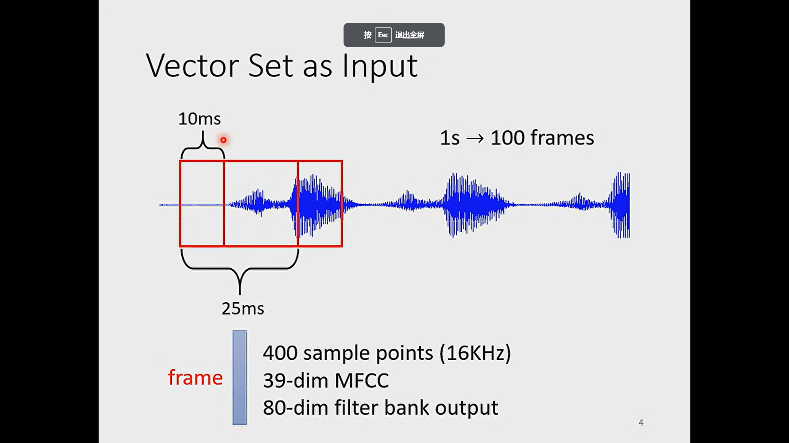
	- graph input
	- 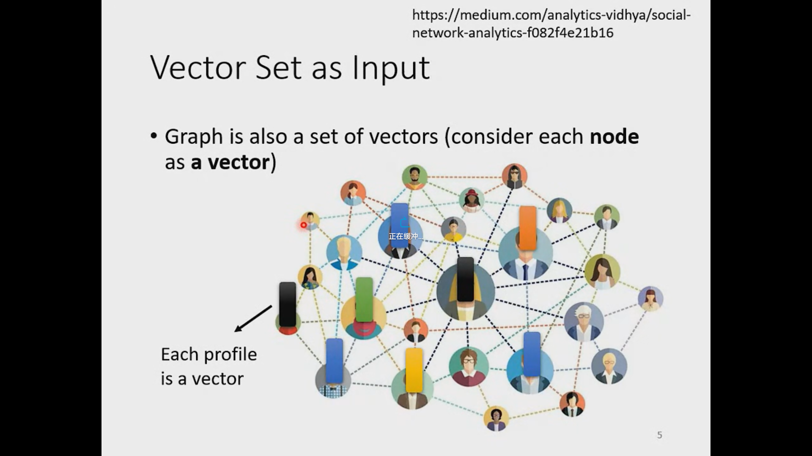
	- 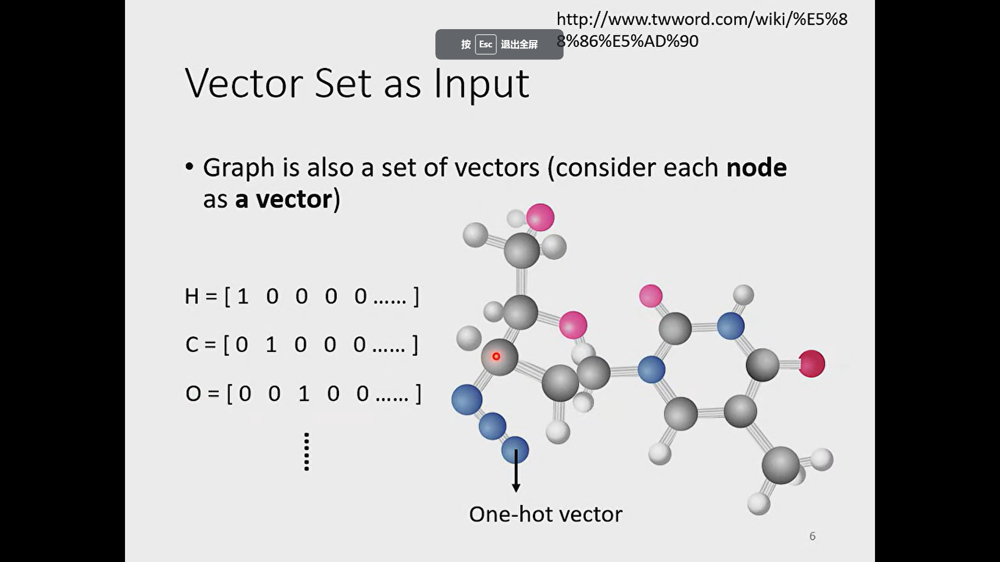
- # What is output
  collapsed:: true
	- 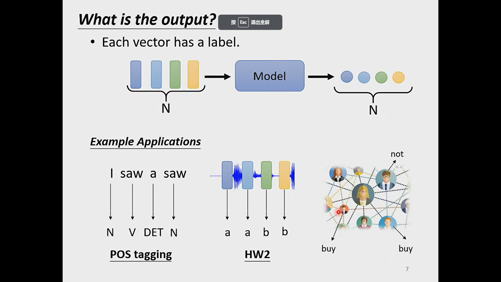
	- 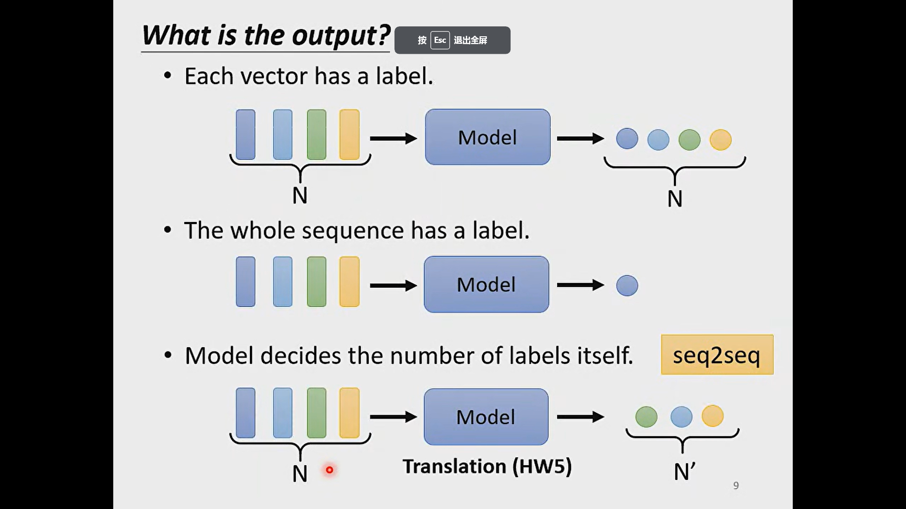
	-
- # Sequence labeling
	- 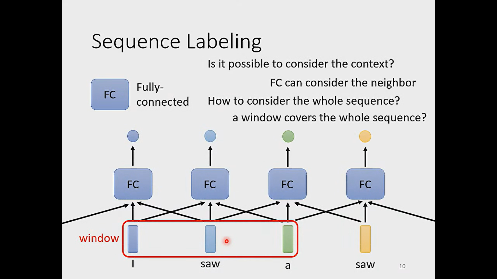
	- we can find the first saw and second saw is different, but only use fc can't discriminate them. To do this, we can set window to let model consider context.
	- we can't consider long sequence just using maximum window size which will create the overfitting and hard to compute. In order to complete this task, we can use self-attention
	- 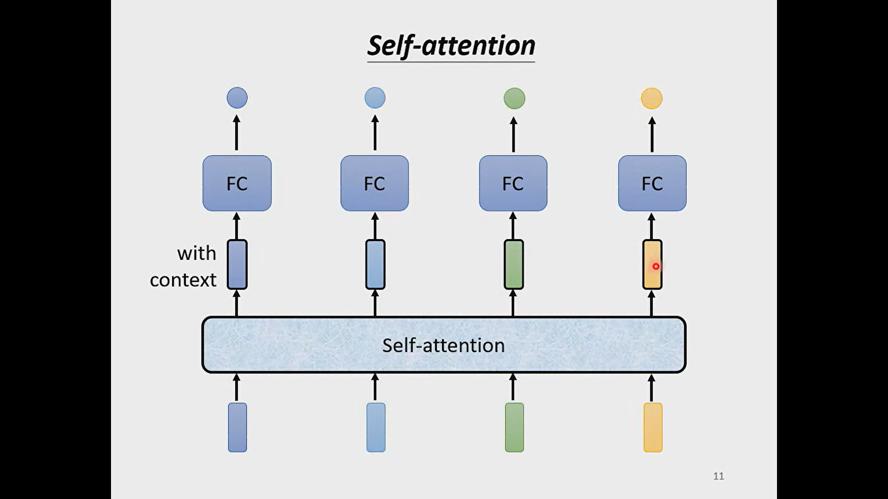
	- the output vector is the vector considering the context
	- 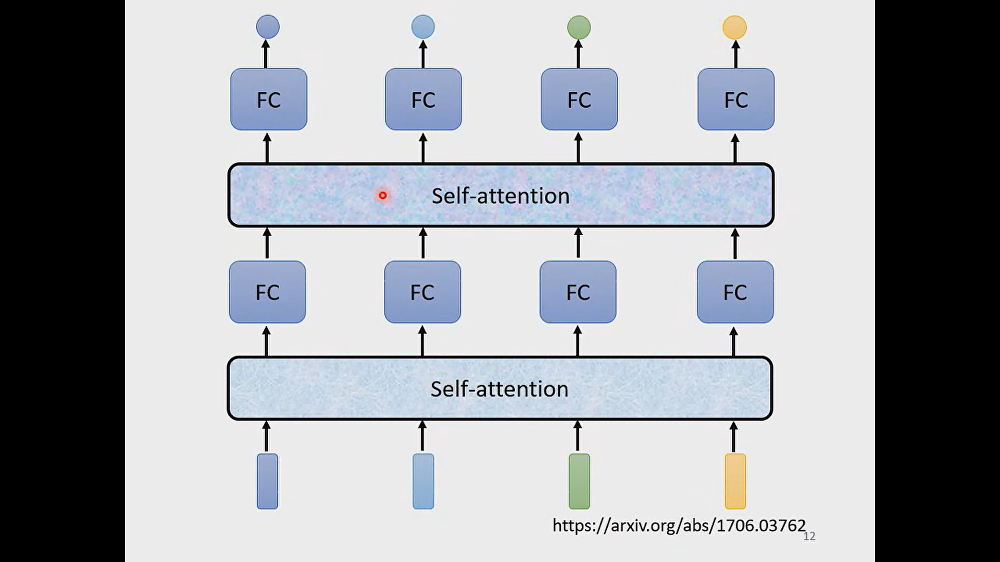
	- we can use self-attention many times
	- ^^Attention is all you need^^ is famous paper
	- 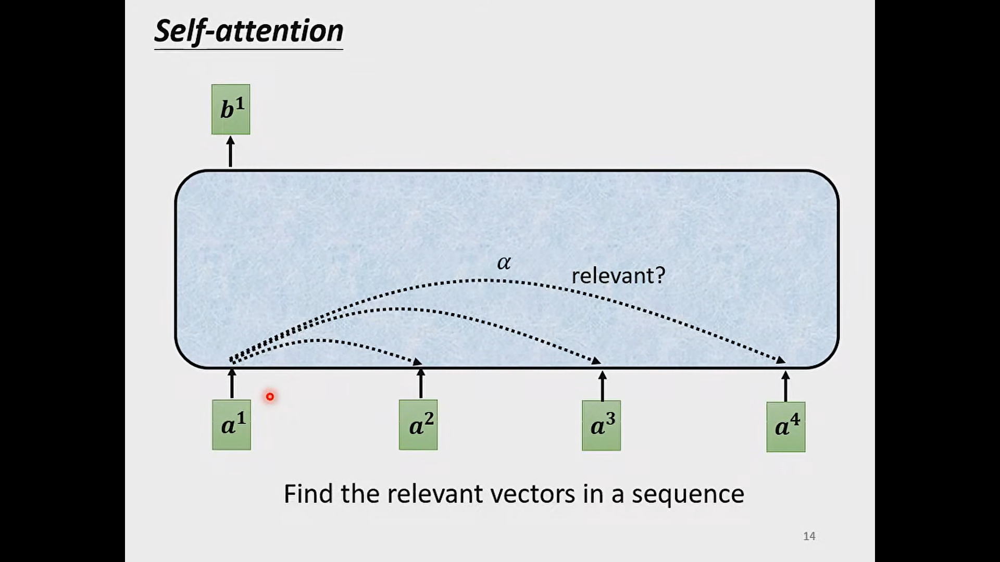
	- 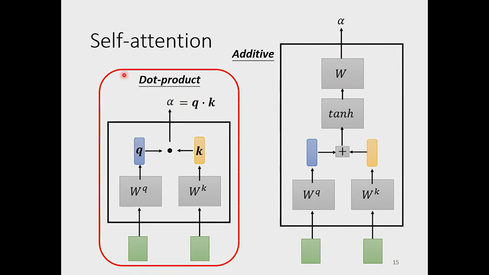
	-