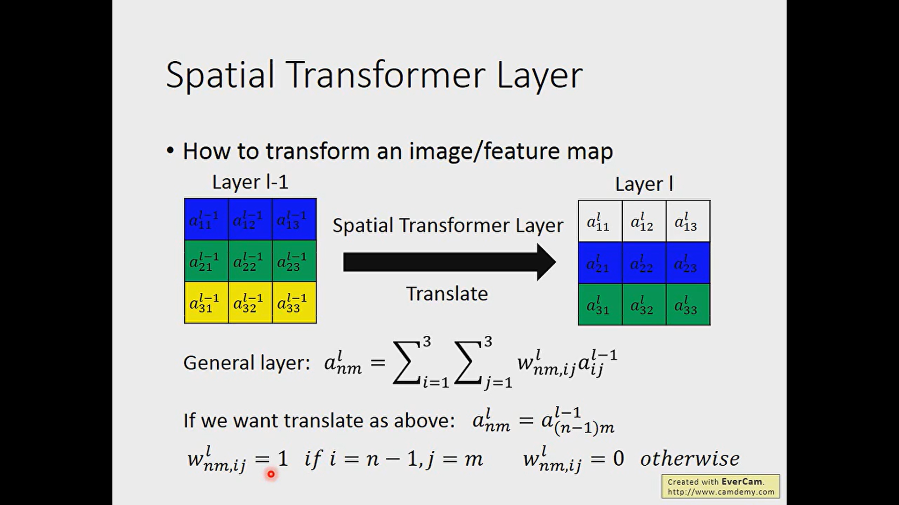
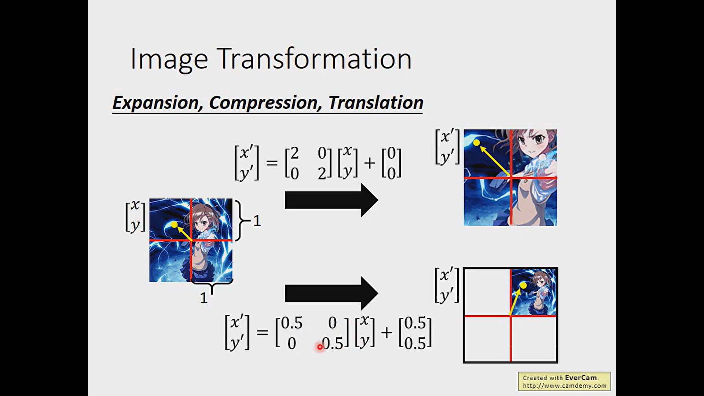
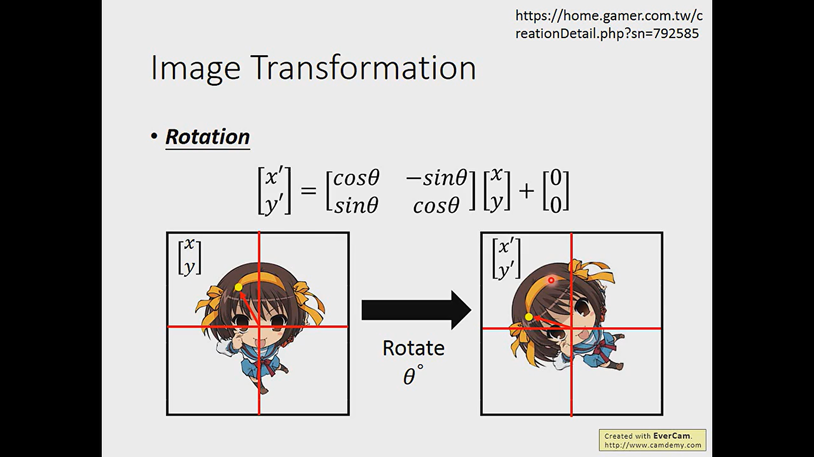

- ^^CNN is not invariant scaling and rotation^^
- 
- # Explain
  collapsed:: true
	- 
	- 
	- the image combined by pixel, we can rotate or scaling by changing the pixel location. ^^Notice^^, the pixel location is integer.
	  id:: 657138a7-59b4-4797-b65b-b028a7ee2f86
	- 
	- 
	- 
	- 
	- If we use round to process the radix, the gradient descend will be not valid. Thereby, we use the interpolation.
	  id:: 657137e2-bd6a-4226-af29-565312a0081b
	- 
	- 
	-
- # Application
  collapsed:: true
	- 
	- 
	- fix the two parameter make the layer only have the scaling function which is similar to focus on some part of object.