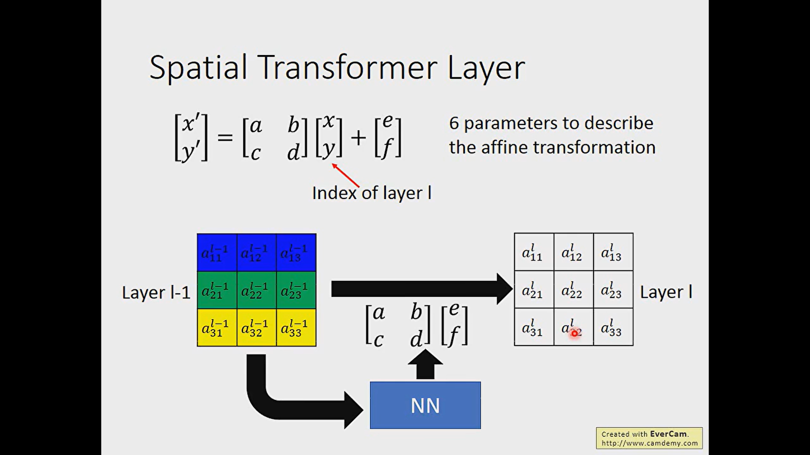
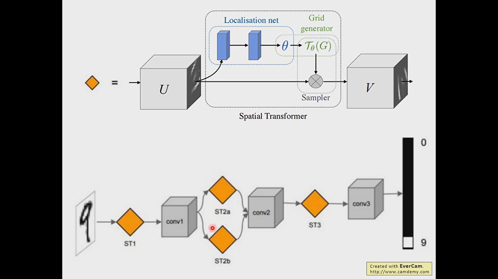

- ^^CNN is not invariant scaling and rotation^^
- 
- # Explain
	- 
	- 
	- 
	- 
	- 
	- 
	- if we use round to process the radix, the gradient descend will be not valid. Thereby, we use the interpolation.
	  id:: 657137e2-bd6a-4226-af29-565312a0081b
	- 
	- 
	-
- # Application
  collapsed:: true
	- 
	- 