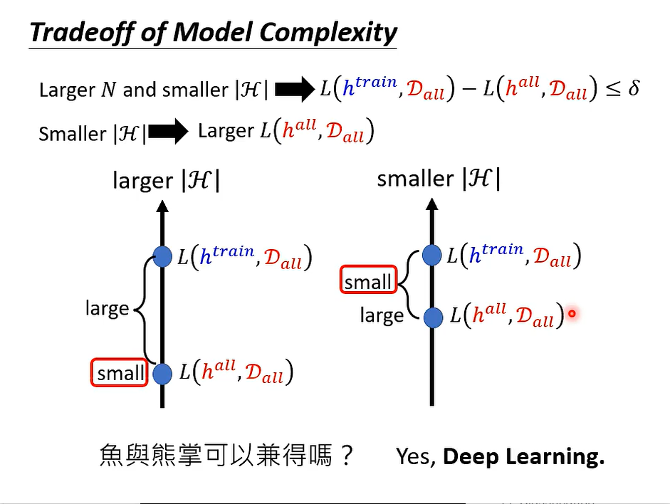

# Pokemon/Digimon Classifier
collapsed:: true
	- Introduction
	  collapsed:: true
		- 
	- Observeation
	  collapsed:: true
		- 
	- Function with unknown parameters
	  collapsed:: true
		- 
	- Loss of a function (given data)
	  collapsed:: true
		- 
	- Training Examples
	  collapsed:: true
		- 
		- 
		- 
	- What do we want?
	  collapsed:: true
		- 
		- 
- # Very General
  collapsed:: true
	- Introduction
	  collapsed:: true
		- 
	- Probability of Failure
	  collapsed:: true
		- 
		- 
		- 
		- 
		- 
		- 
		- 
		- 
	- Example
	  collapsed:: true
		- the $$H$$ means model complexity, and the $$N$$ means train data size.
		  collapsed:: true
			- 
		- Think in another way
		  collapsed:: true
			- 
	- Another problem (what's the and how to compute Model Complexity)
	  collapsed:: true
		- 
		- 
	- Tradeoff of model complexity
	  collapsed:: true
		- 
- # The closer the ideal and the reality, the better.
-