- 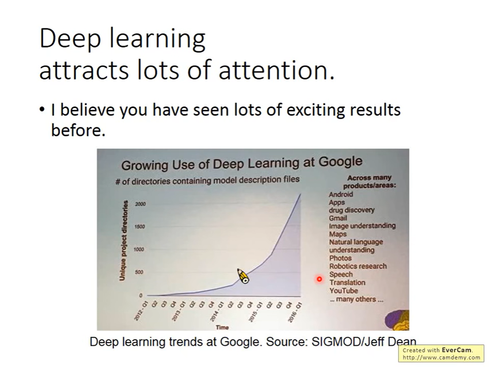
- # Ups and downs of Deep Learning
  collapsed:: true
	- 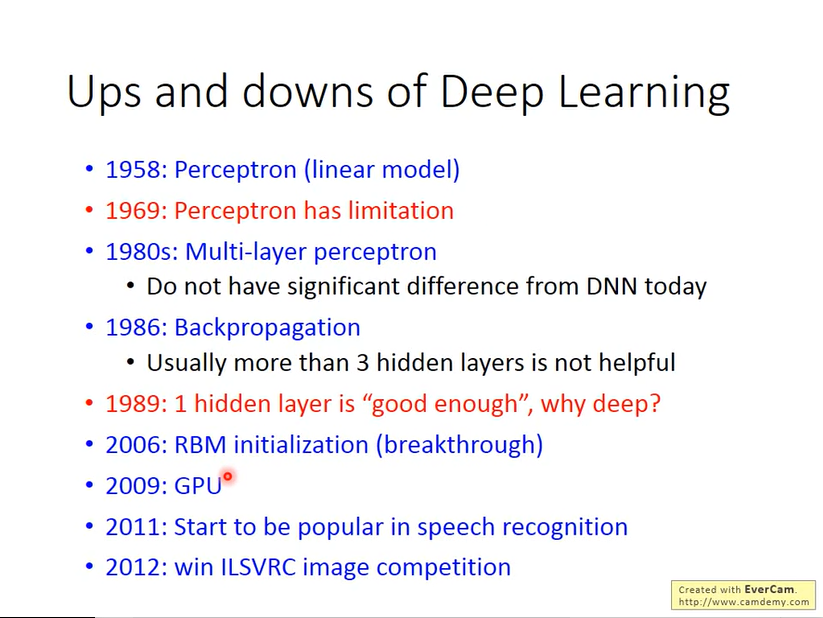
- # Three steps for deep learning
  collapsed:: true
	- 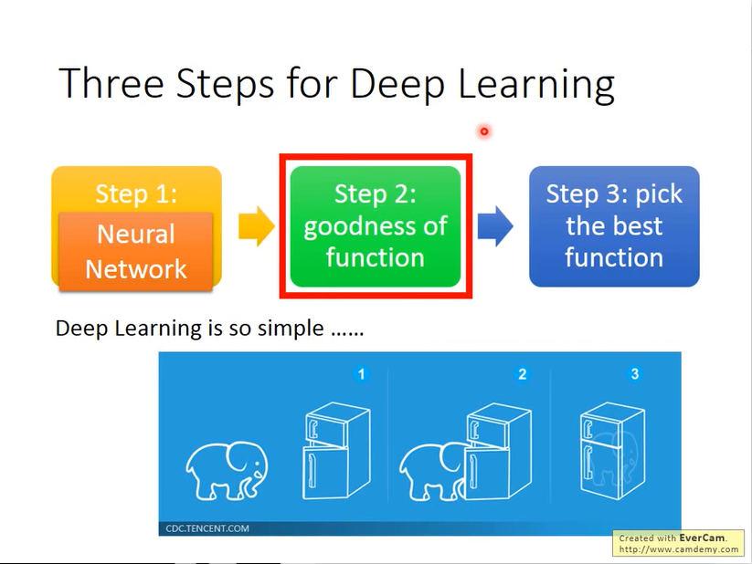
	- step 1: {{embed ((64fbe613-ba0a-4b95-a77b-d4e11c14452a)) }}
	- step 2:
	- step 3:
- # How to connect the layers?
  id:: 64fbe613-ba0a-4b95-a77b-d4e11c14452a
  collapsed:: true
	- Fully Connect Feedforward network
	  collapsed:: true
		- 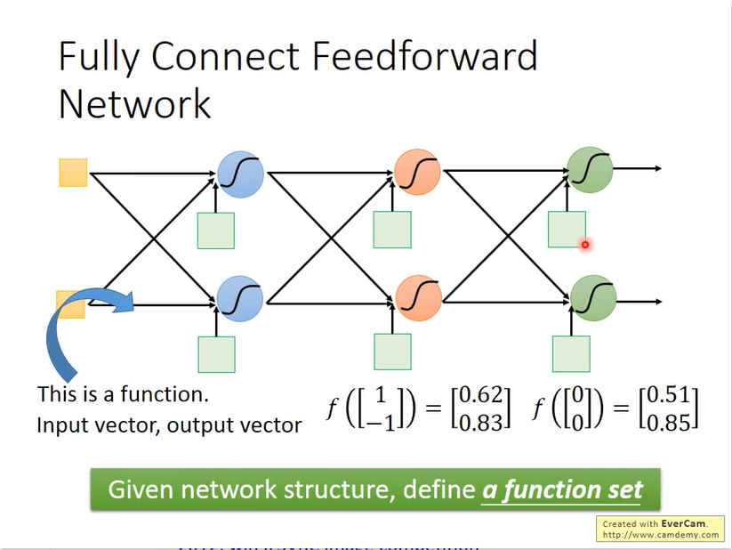
		  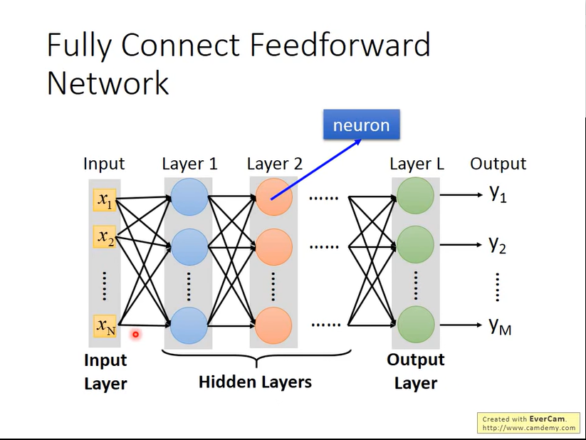
	- Deep $$=$$ Many hidden layer
	  collapsed:: true
		- The Residual Network beat the human in the image recognition.
			- 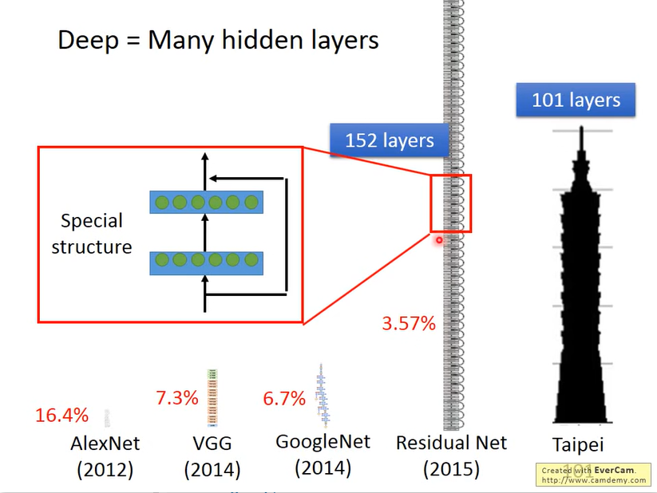
	- NN is a series of maxtrix operation
	  collapsed:: true
		- 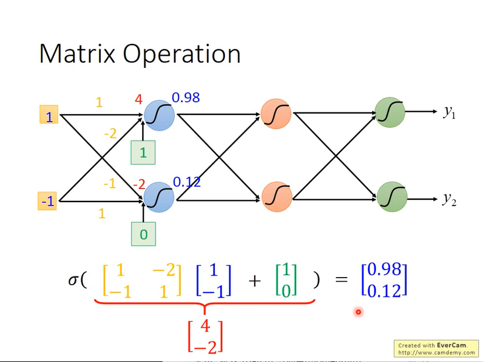 
		  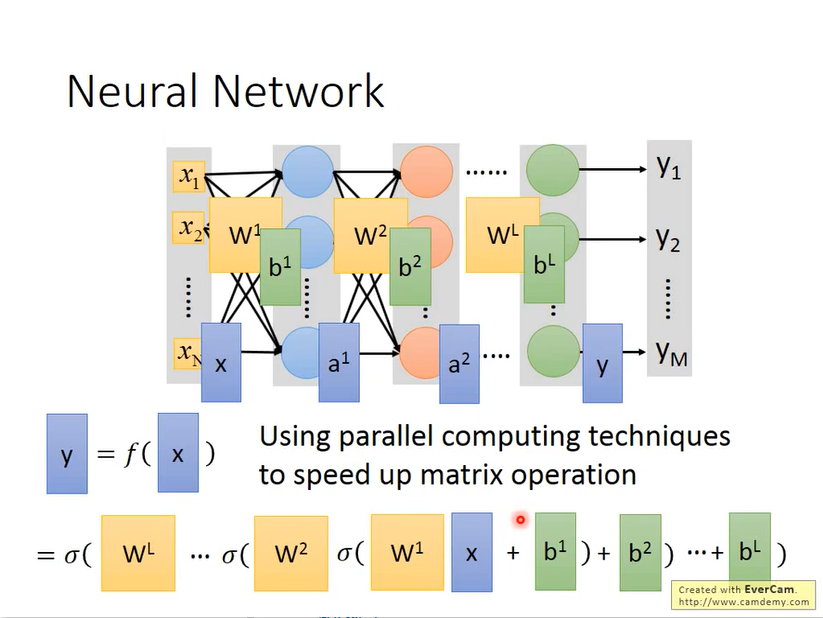
	- output layer
		- hidden layer extract feature. we consider the output layer as multi-class classifier so we need to add the softmax function after the output layer.
		  collapsed:: true
			- 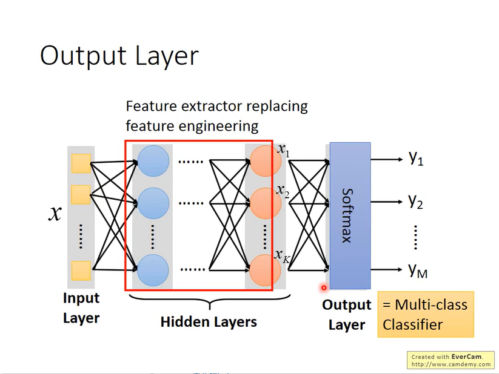
		- example
		  collapsed:: true
			- 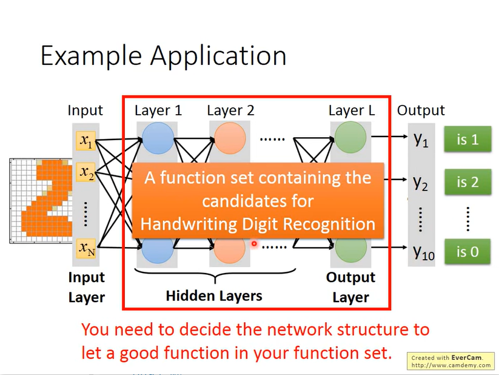
	- FAQ
	  collapsed:: true
		- When we use machine learning before, we need to do some feature engineer. But now, we can use deep learning that can use hidden layer extract the feature. What we need to know is converting one question into another question.
		  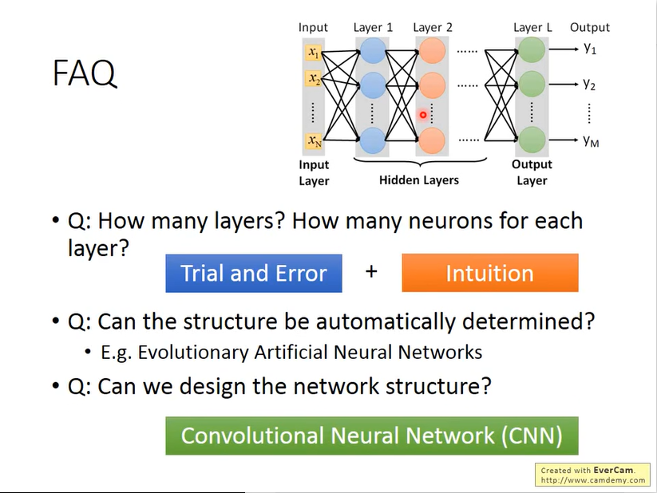
- # How to define goodness of loss function?
  collapsed:: true
	- Loss for an example
	  collapsed:: true
		- 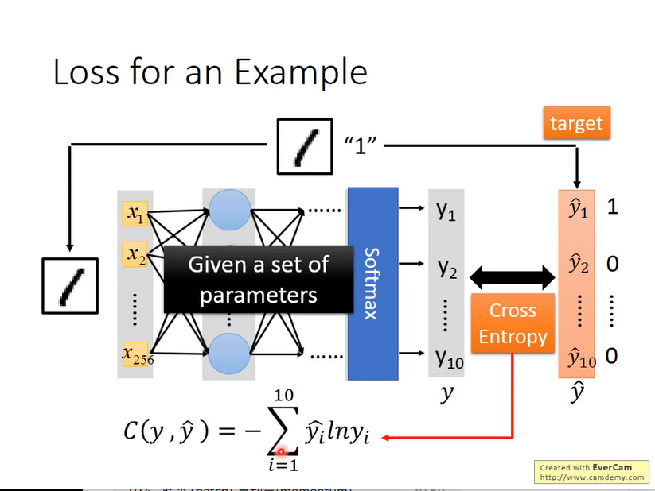
	- Total Loss
	  collapsed:: true
		- 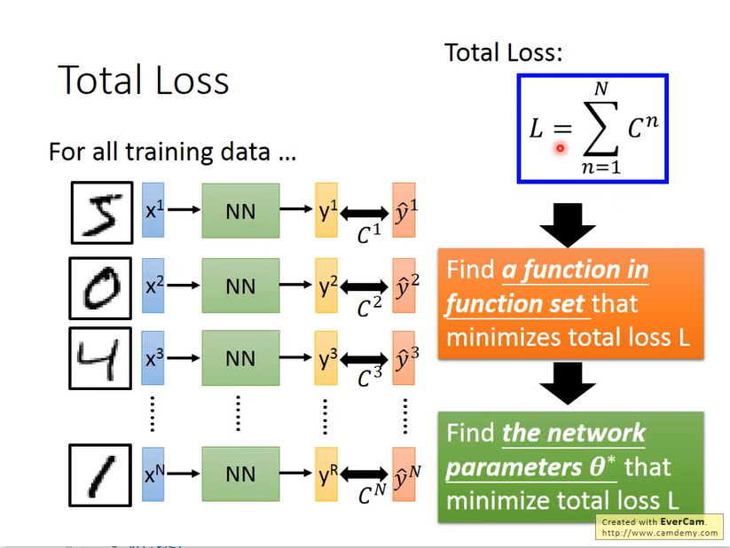
	- Gradient Descent
	  collapsed:: true
		- 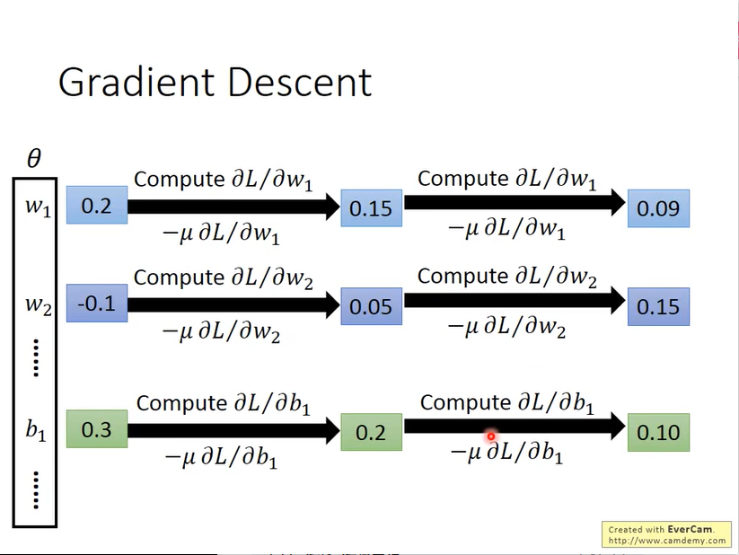{:height 398, :width 520}
		  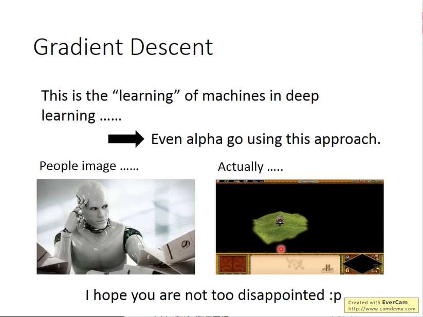
	- Backpropagation
	  collapsed:: true
		- in the past time, it's very difficult for the people who want to do deep learning because they need to implement the backpropagation. Now we have many tools to do the backpropagation. The reason why we need to do backpropagation is that it's efficient to calculate differential when the model's parameters is huge.
			- 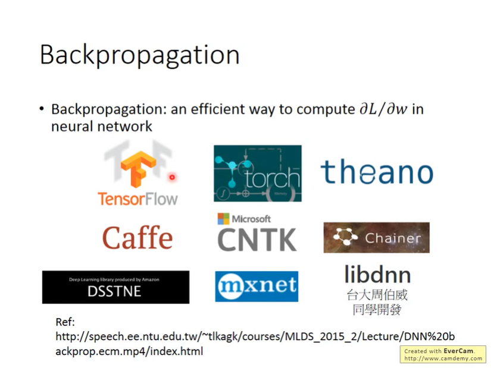
			-
- # Why do we do the deep learning?
  collapsed:: true
	- Deeper is Better?
	  collapsed:: true
		- 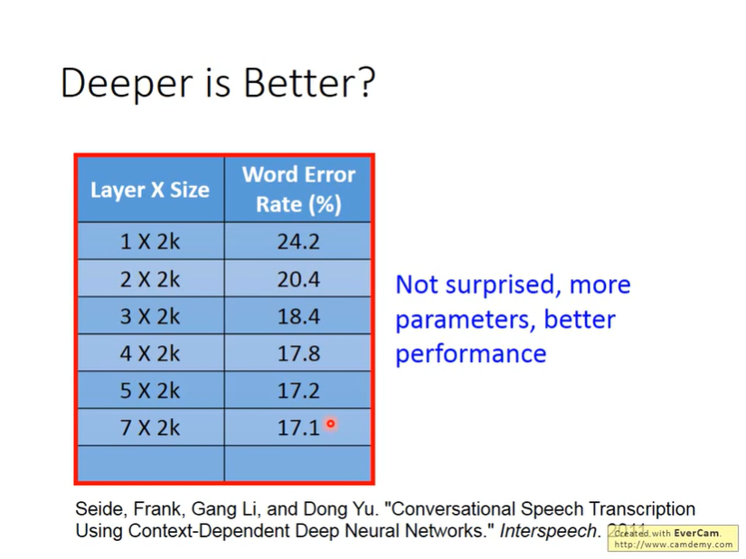
	- There is a theory.
	  collapsed:: true
		- Any continuous function f can be realized by a network with one hidden layer (given enough hidden neurons).
		  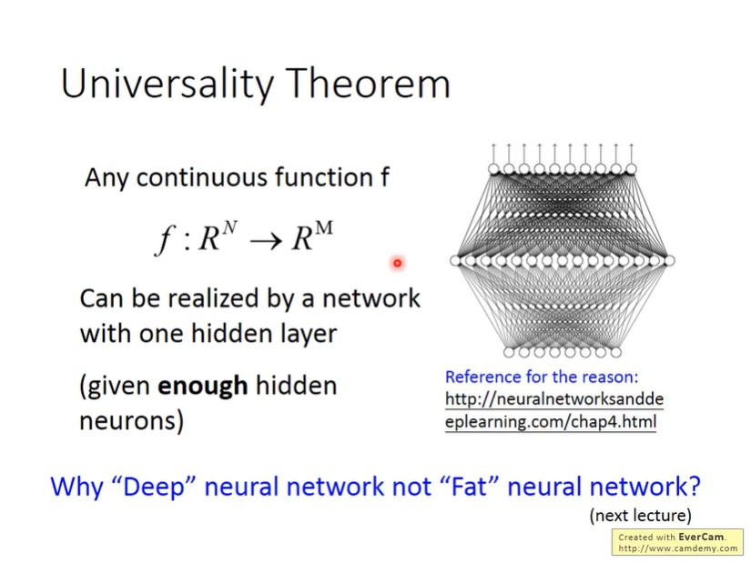
		- Why choose deep not the fat? This questions will will be answered in the following courses.
		-
- # References
  collapsed:: true
	- 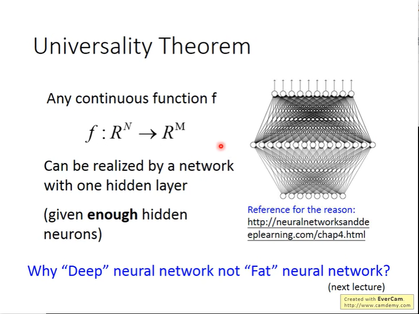