# Tasks
collapsed:: true
	- 
- # Data
  collapsed:: true
	- 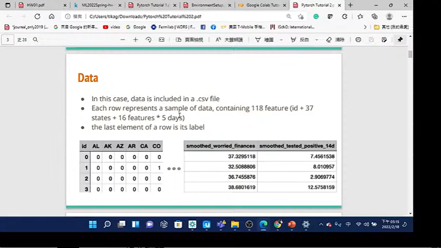
- # Load data/Processing
  collapsed:: true
	- 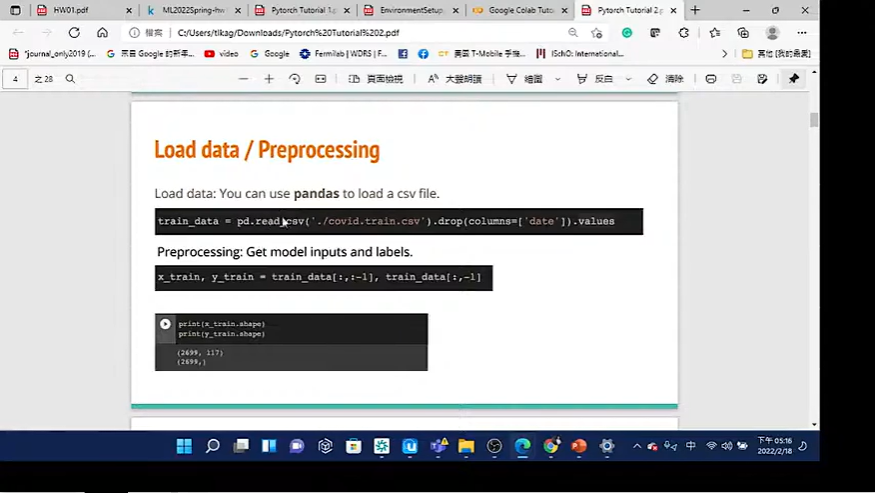
- # Dataset
  collapsed:: true
	- 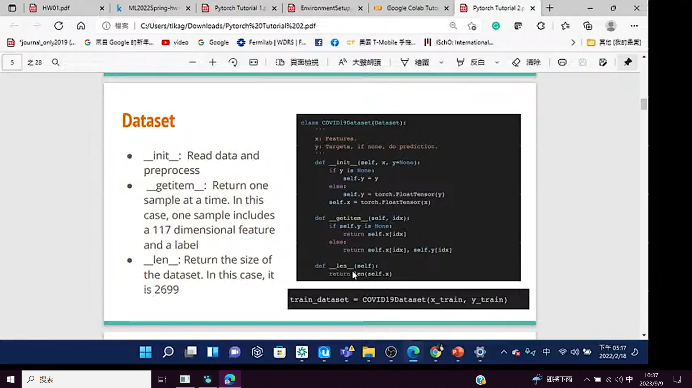
- # Dataloader
  collapsed:: true
	- 
- # Model
  collapsed:: true
	- 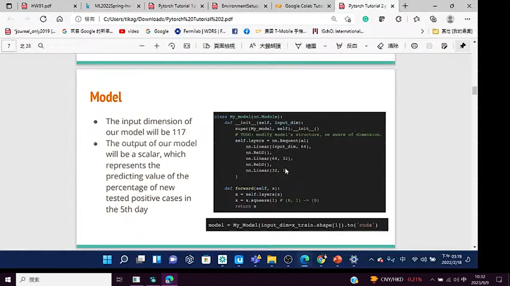
- # Criteion
  collapsed:: true
	- 
- # Optimizer
  collapsed:: true
	- 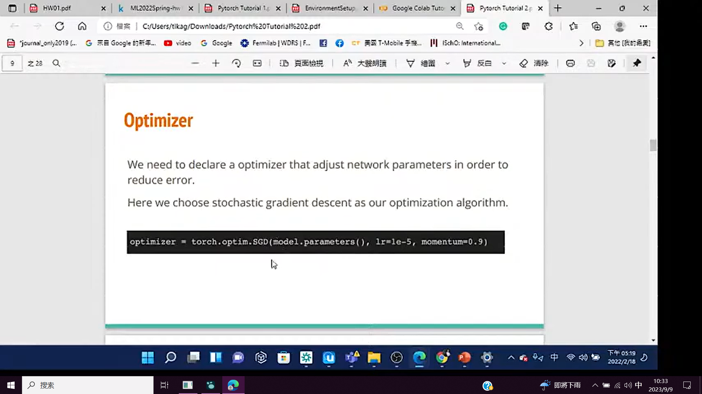
- # Training loop
  collapsed:: true
	- 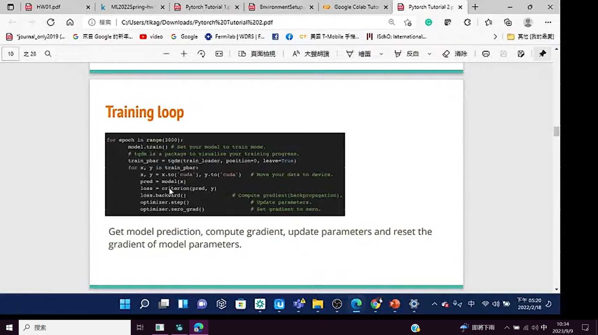
- # Pytorch Documents
  collapsed:: true
	- 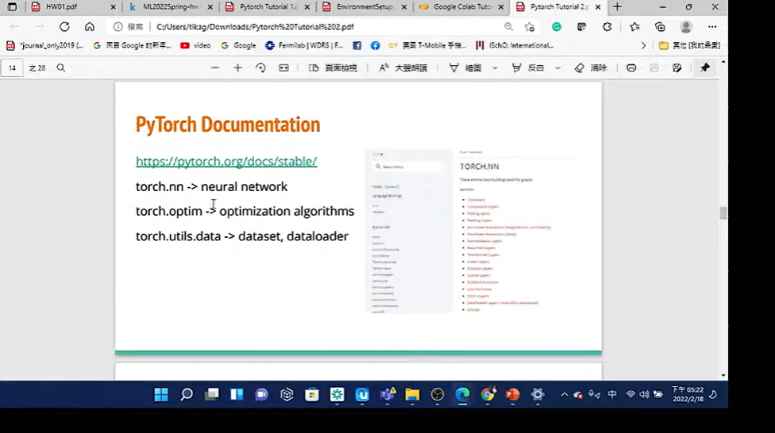
- # Common error
	- ## Tensor on different device
	  collapsed:: true
		- 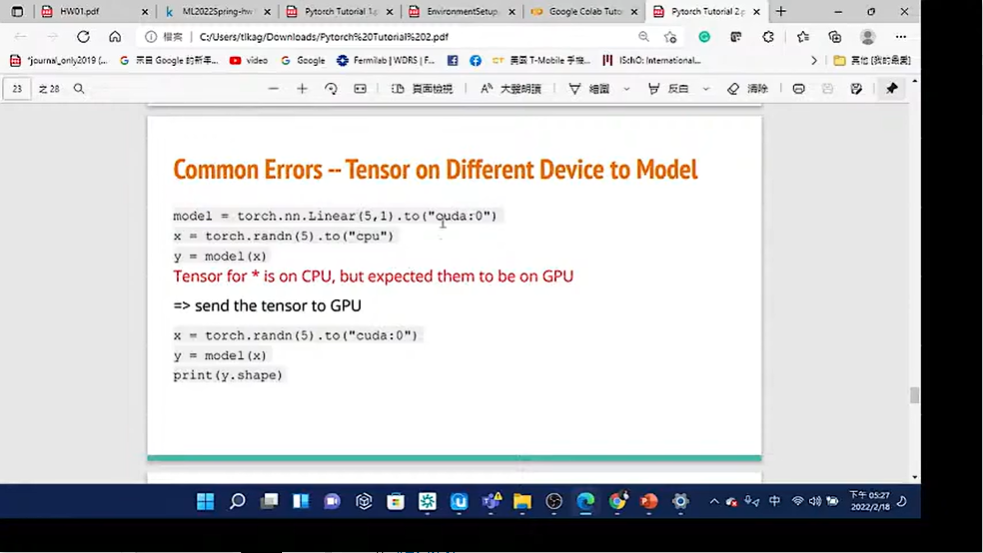
	- ## Mismatch Dimensions
	  collapsed:: true
		- 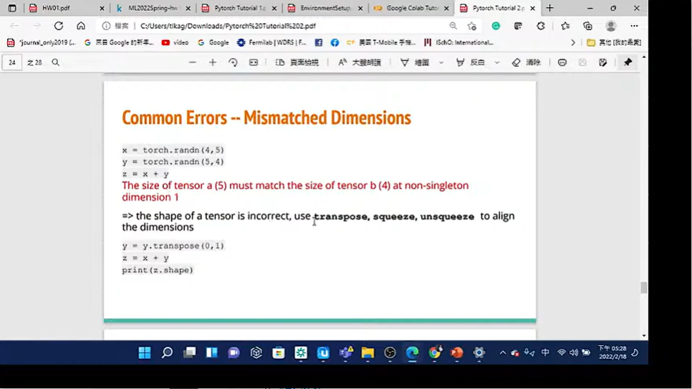
	- ## Cuda out of memory
	  collapsed:: true
		- 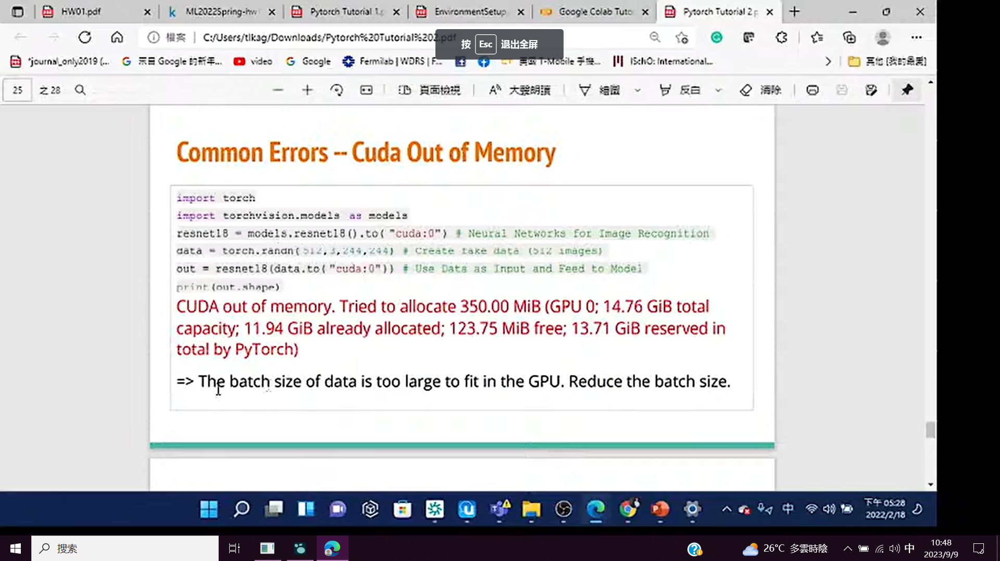
		  id:: 64fbdcf8-ceed-41e9-9920-5fe24cf863c1
	- ## Mismatched Tensor Type
	  collapsed:: true
		- 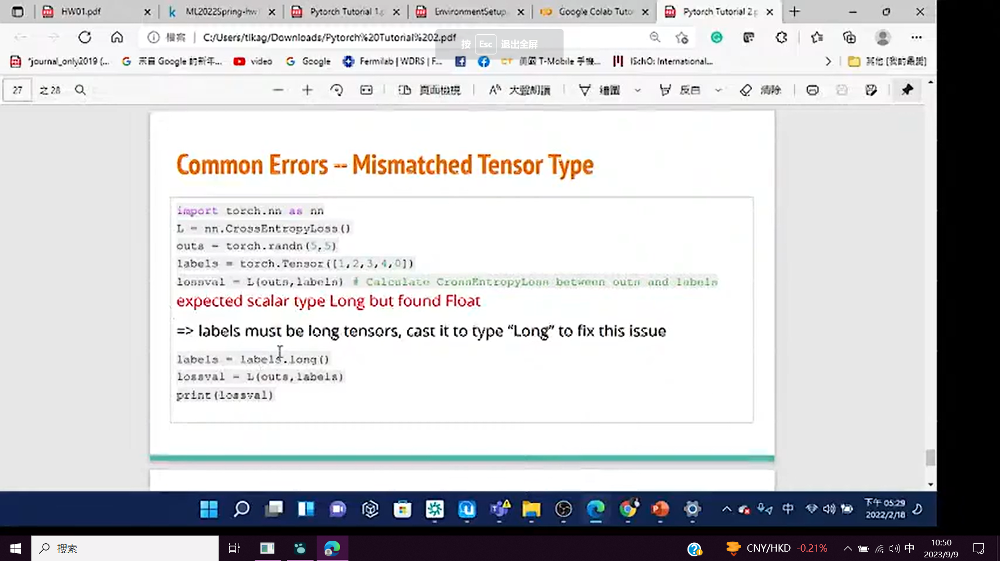