- Just record the things that i don't know
- # What is Pytorch?
	- machine learning framework
- # The step of training & testing nn
  collapsed:: true
	- 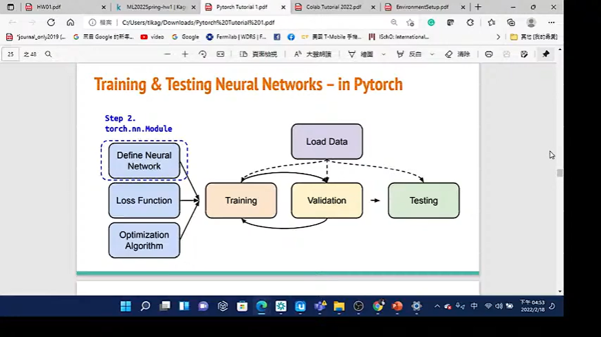
- # How to input the data?
	- # Dataset & Dataloader
	  collapsed:: true
		- 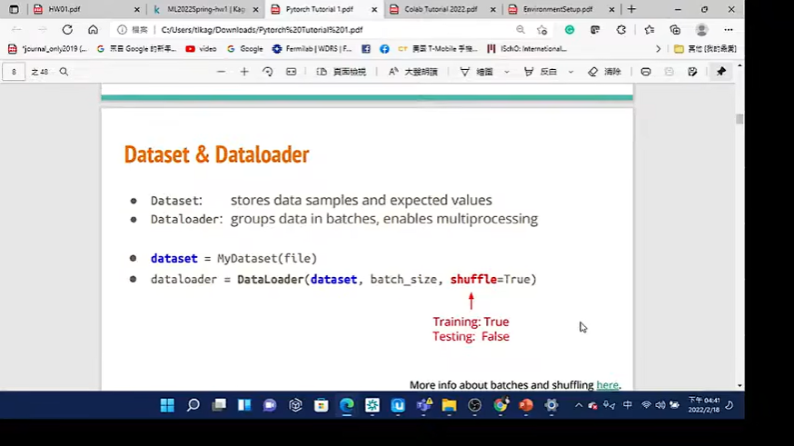{:height 317, :width 550}
		  
	- # How to create the tensor?
	  collapsed:: true
		- 
		  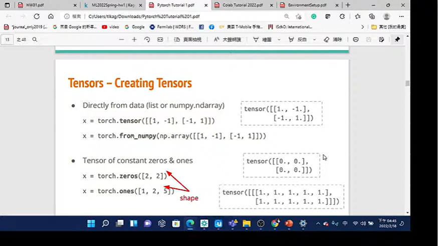
	- # Common operations
	  collapsed:: true
		- 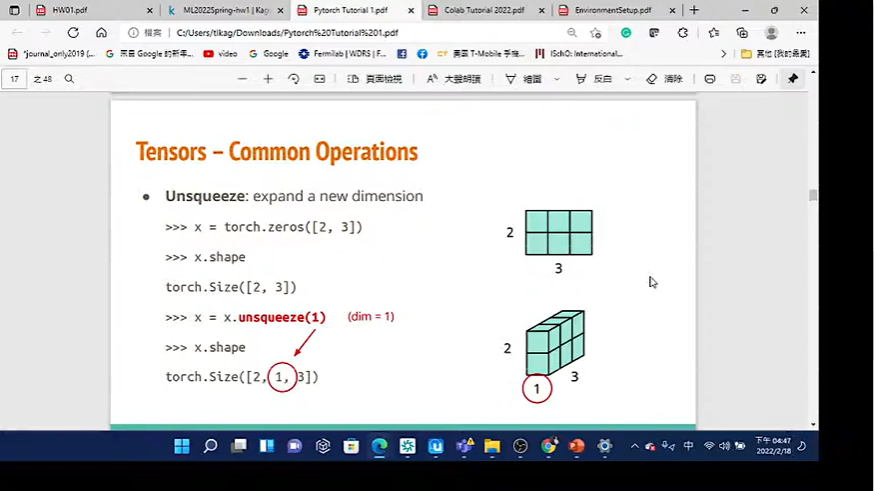
		  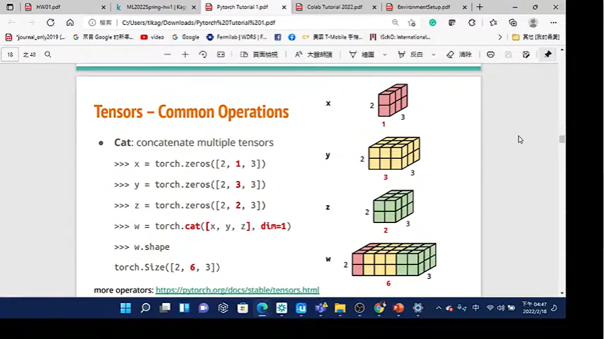
	- # Tensors -  Data Type
	  collapsed:: true
		- 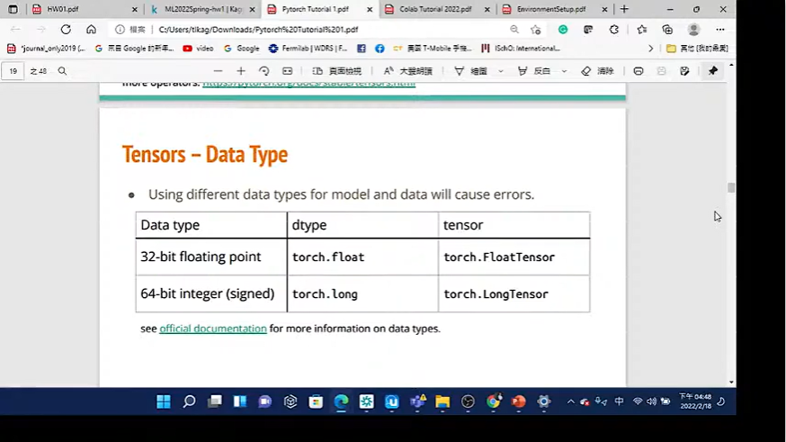
	- # Pytorch vs Numpy
	  collapsed:: true
		- 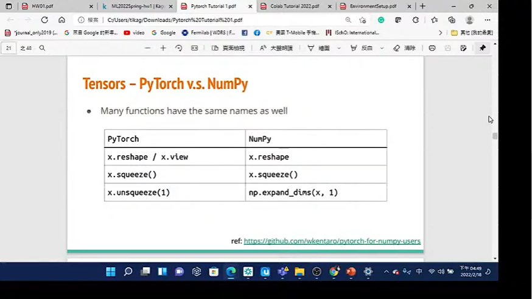
	- # Tensors - Device
	  collapsed:: true
		- 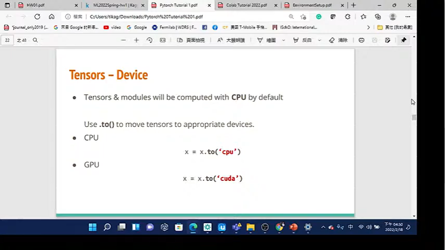
		  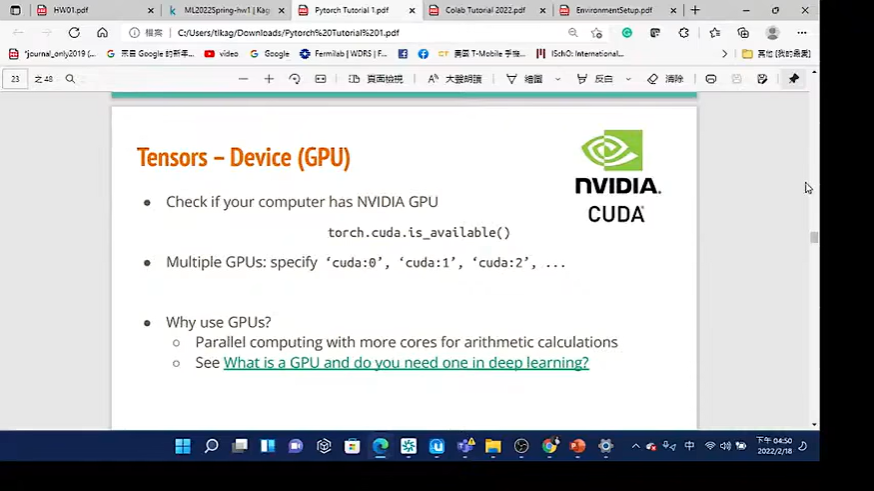
	- # Tensor - Gradient Calculation
	  collapsed:: true
		- 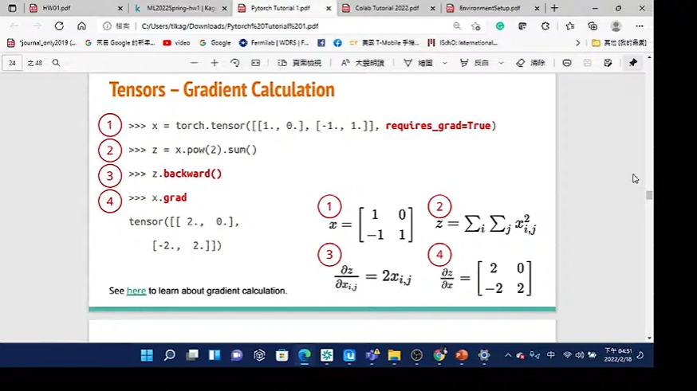
- # How to train?
  collapsed:: true
	- ## torch.nn - networks layers
	  collapsed:: true
		- 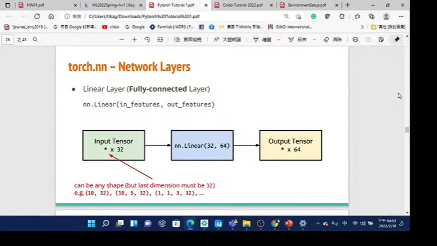{:height 317, :width 550}
		  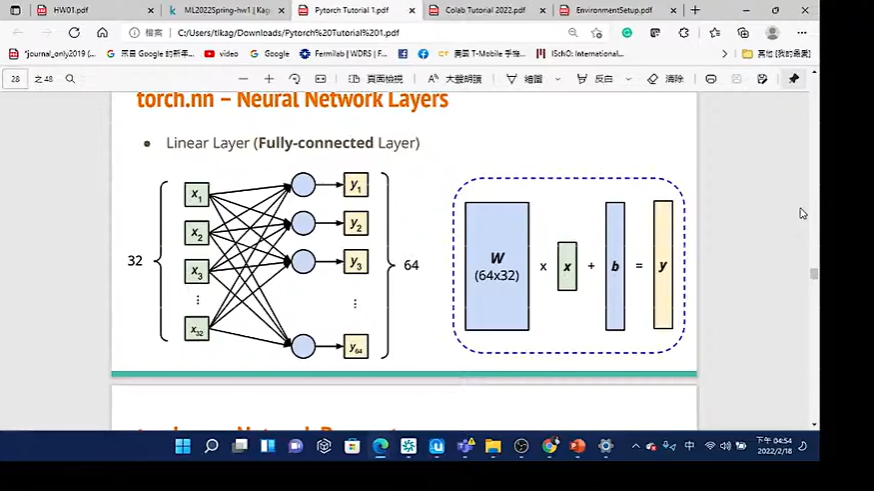
		  
	- ## Activation functions
	  collapsed:: true
		- 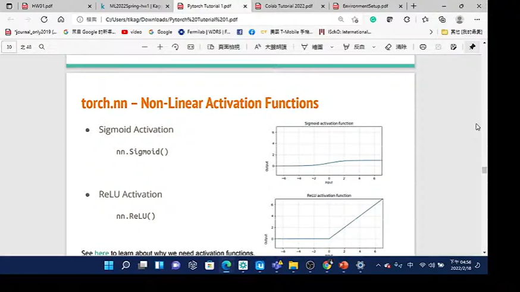
	- ## Build nn
	  collapsed:: true
		- 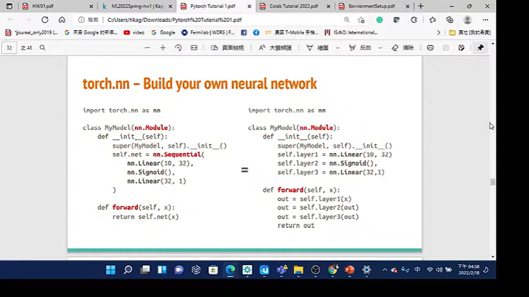
	- ## Loss functions
	  collapsed:: true
		- 
		  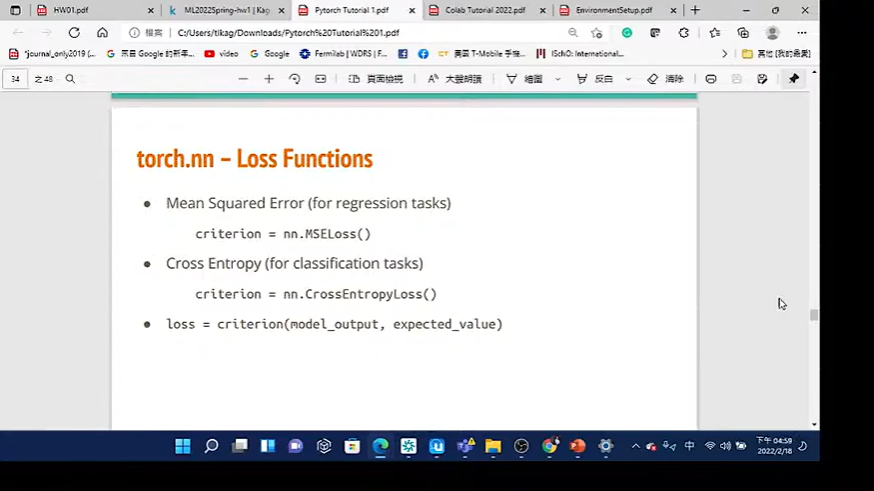
	- ## optim
	  collapsed:: true
		- different way to gradient descent
			- 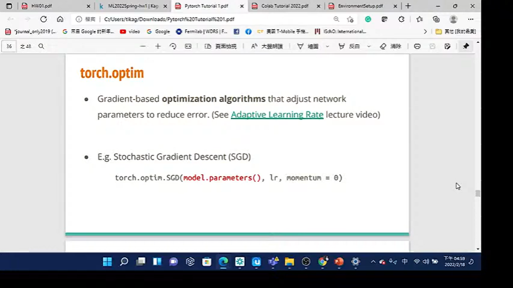
			  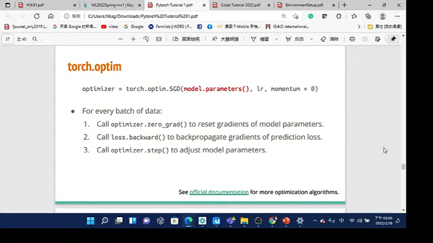
		-
	- ## NN training loop
	  collapsed:: true
		- 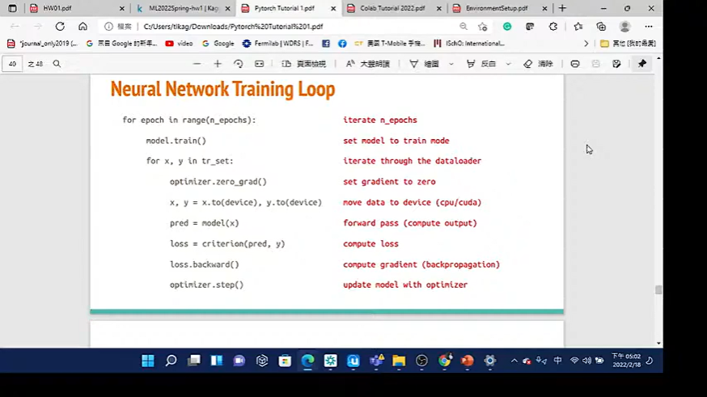
	- ## NN validation loop
	  collapsed:: true
		- 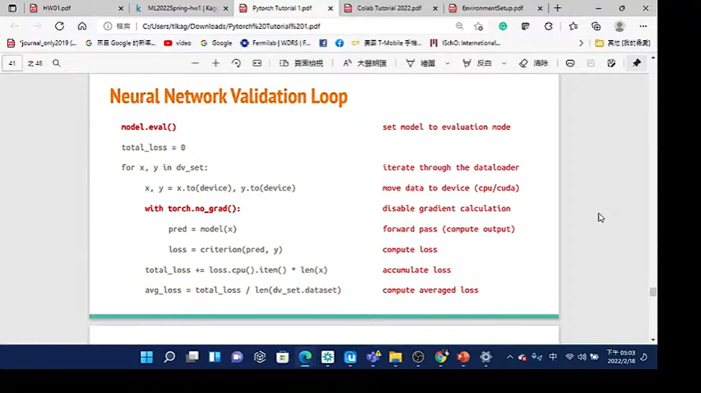
	- ## NN testing loop
	  collapsed:: true
		- 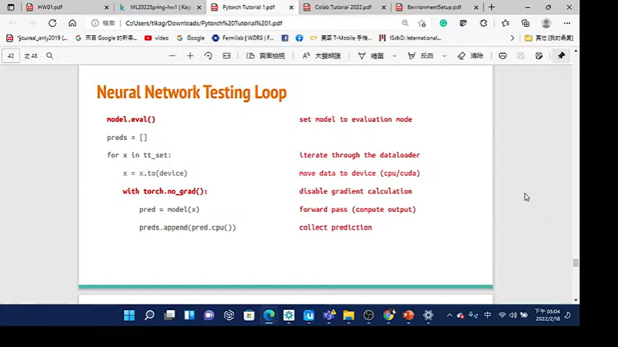
	- ## why change model & no_grad?
		- 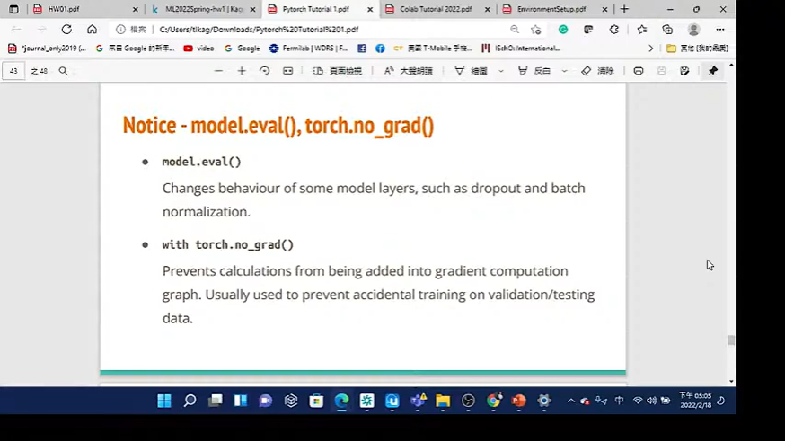
- # How to save/load trained models?
  collapsed:: true
	- 
- # More about Pytorch?
  collapsed:: true
	- 
	  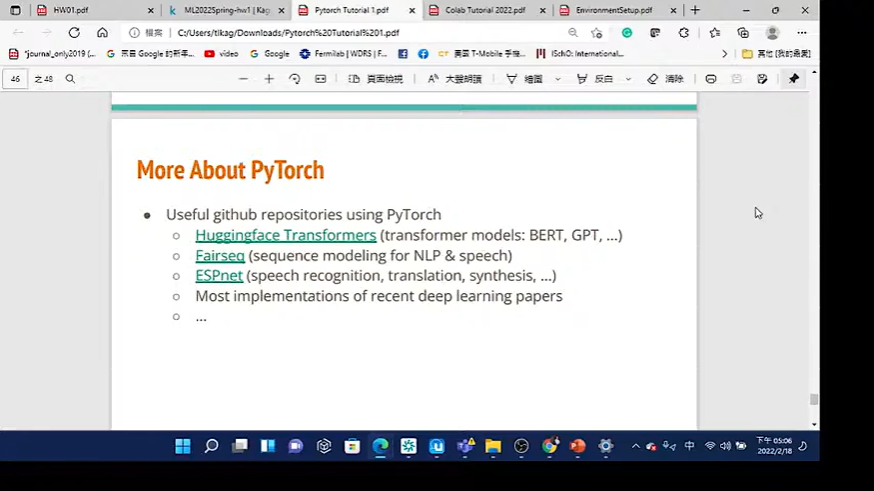
- # References
	- 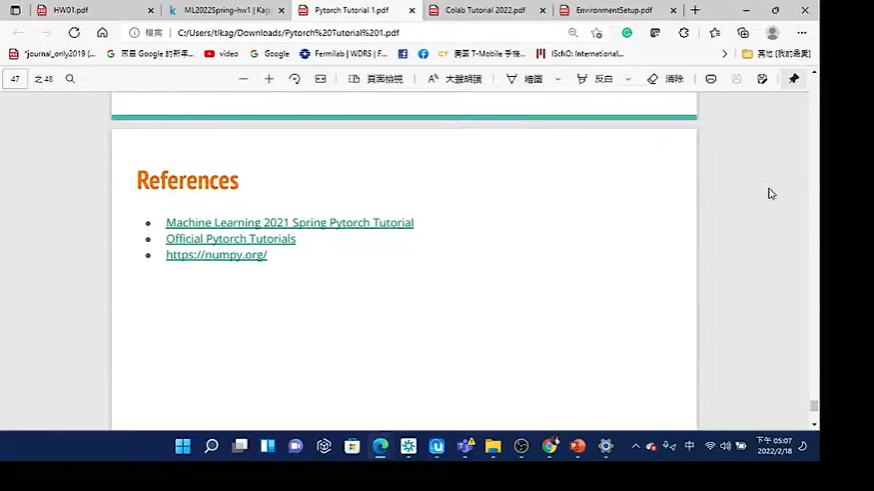