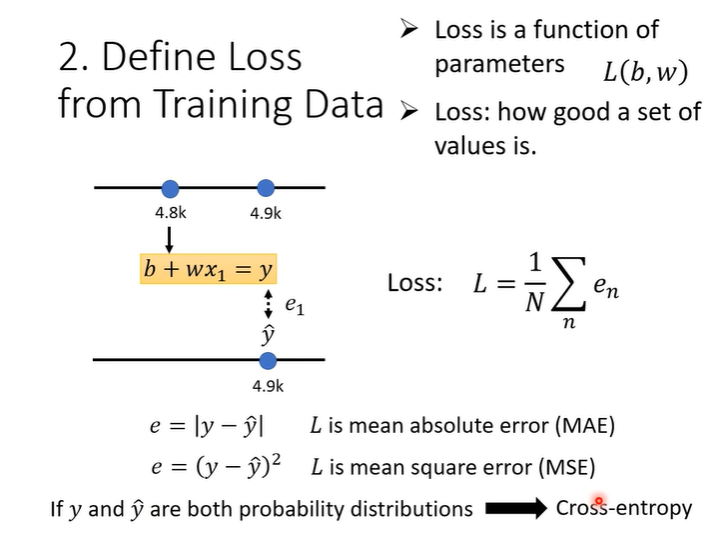

- Machine Learning $\approx$ Looking for function. For example, it's very difficult for human to draw the function of image, speech recognition and playing go. So we need to the machine help us to look for these hard tasks function.
  collapsed:: true
	- 
- # Different types of Functions
  collapsed:: true
	- **Regression**: The function outputs a scalar, such as predict the PM2.5.
	  
	- **Classification**: Given the options(**classes**)
	  
	  
	- **Structured Learning**: create something with structure (images, documents)
	  
- # How to create a model to predict something?
  collapsed:: true
	- ## 1. Function with unknown parameters
	  collapsed:: true
		- Domain knowledge use to find a suitable initial function style, such as the $y=b+wx$
		- 
		- {{embed ((64fafcc0-c00d-49f0-b8be-3652e8f10f53))}}
	- ## 2.Define Loss from Training Data
	  collapsed:: true
		- 
		- {{embed ((64faf8f2-939e-40ae-9b68-946c27db9472))}}
	- ## 3. Optimization
	  collapsed:: true
		- The way to optimization in this course is **Gradient Descent**
		- 
		- When we do the deep learning, the local minima is not the truly problem we need to deal with.
		- how to use this way?
		  collapsed:: true
			- {:height 398, :width 520}
			  
		- {{embed ((64fb0362-4c77-4d24-bfd0-938856e67e3c))}}
- Machine learning is so simple with the three steps(only use to train). we need to know the train loss and the test loss, the second one is loss for the unseen data.
  collapsed:: true
	- 
	- According the model performance, we need to change the model according to the domain knowledge. For example, the first model in the follow first figure is bad. And we rewrite a new model(can see in the second figure) by observing the data we collected. Then we compare the test loss among the different models. In second figure, we improve model by adding the days need to thinking. We can find that when the number of days considered reaches a certain value, the model's ability can no longer be improved.
	  collapsed:: true
	  All of the follow models is **Liner model**.
		- 
		  
- Liner models are too simple to solve the more difficult tasks. We need to the more sophisticated models . This model limitation is from the **model bias**.
  id:: 64fafcc0-c00d-49f0-b8be-3652e8f10f53
	- We can use the constant and the sum set of blue function to make the red curve.  
	  collapsed:: true
	  **Liner curve**
	  **Piecewise Liner curve**(the red curve in the first figure)
	  **Beyond Piecewise Liner**.
		-  
		  
		  
		  
	- How to write the curve?
	  collapsed:: true
		- Just to add sigmoid function and adjust the $w$, $c$ and $b$ to get the different blue function. Then we combine many blue function to get more sophisticated red function.
			- 
			  
			  
			-
		- We get the new model that have more features.
			- 
			  
			  
			  
			  
- When rewrite the model(function), how to calculate loss function?
  id:: 64faf8f2-939e-40ae-9b68-946c27db9472
	- {:height 421, :width 550}
- Optimization of new model
  id:: 64fb0362-4c77-4d24-bfd0-938856e67e3c
  collapsed:: true
	- 
	  
	- use batch randomly gradient descent
		- 
		- update means update the para every time, epoch means see all batches. Can tel the different between the batch and the epoch in the follow image.
		  
- More variety of models
  collapsed:: true
	- We also get the blue function by using relu.
		- 
		- 
	- Experimental Results
		- 
- We can continue to improve the model. Just increase the depth(how many layers we need).
  collapsed:: true
	- 
	- Experimental Results
		- 
		  
- Give a fancy name.
  collapsed:: true
	- {:height 421, :width 550}
- Deep $=$ Many hidden layer
  collapsed:: true
	- 
- Why don't we go deeper?
  collapsed:: true
	- 