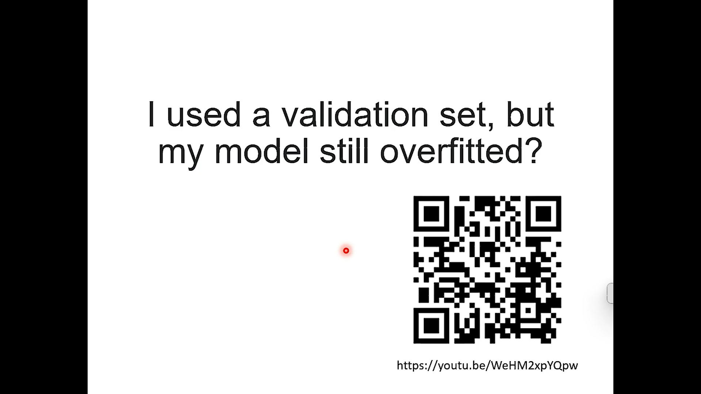
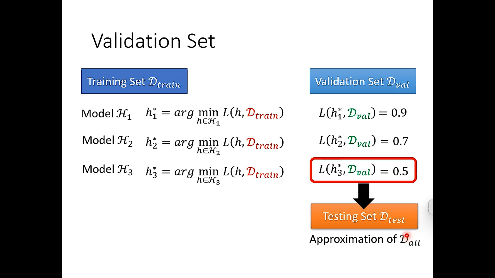
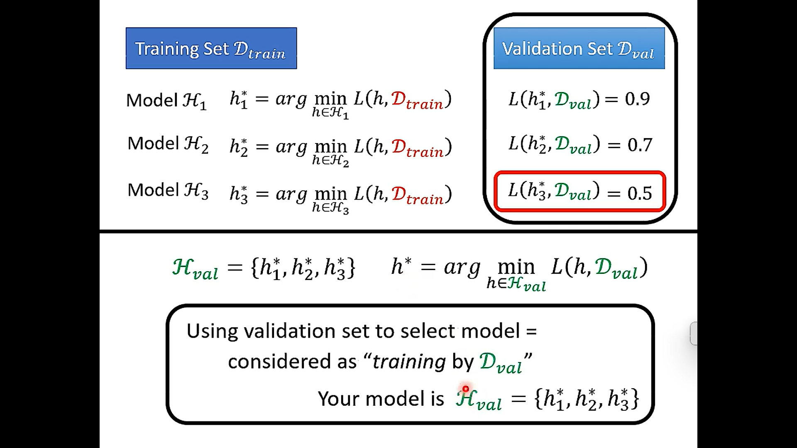
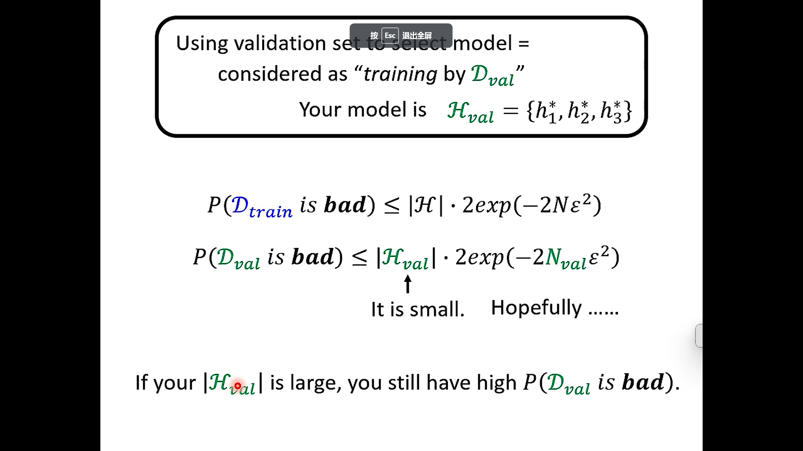

- 
- 
- 
- 
- when you use the validation set, if the number of model to select is large(or the model is complex), you also will get the bad model(overfitting)
- [为什么用了验证集结果还是过拟合了_哔哩哔哩_bilibili](https://www.bilibili.com/video/BV1m3411p7wD?p=23&vd_source=4509a4938eb6aed461dbcca76232f0dc)