# Introduction
collapsed:: true
	- 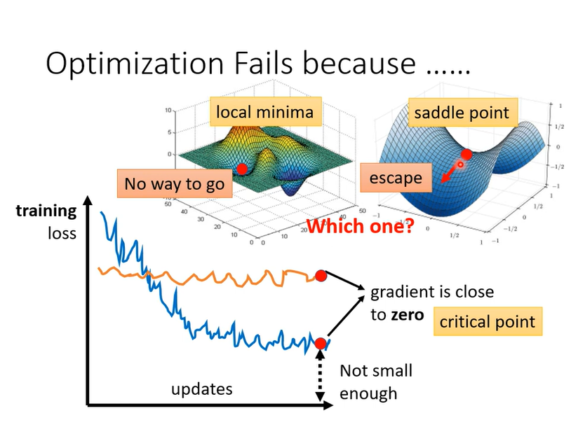
- # Math Proving
  collapsed:: true
	- 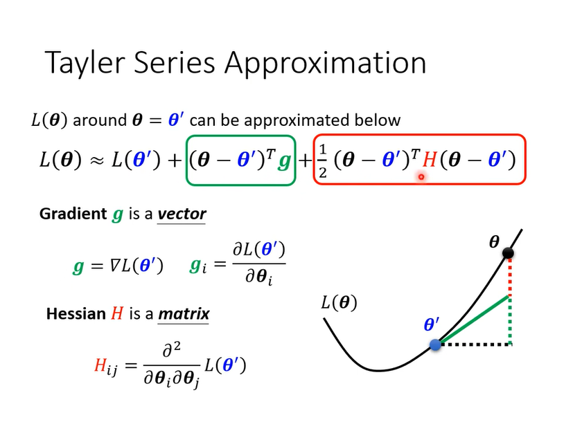
	- 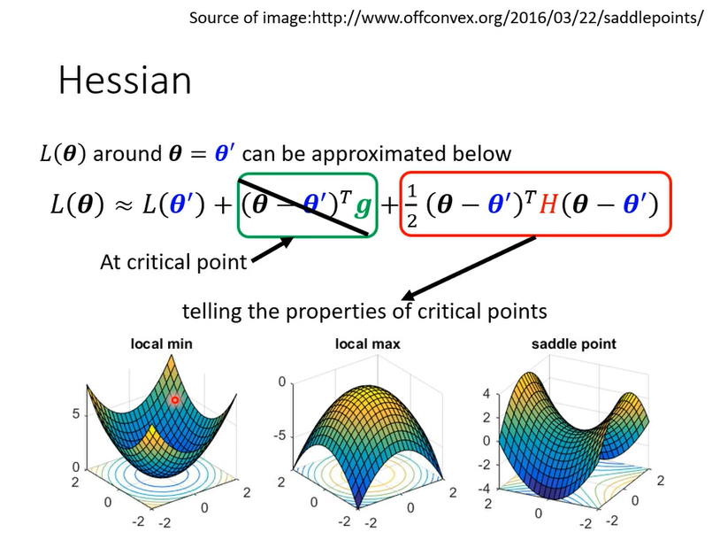
	- 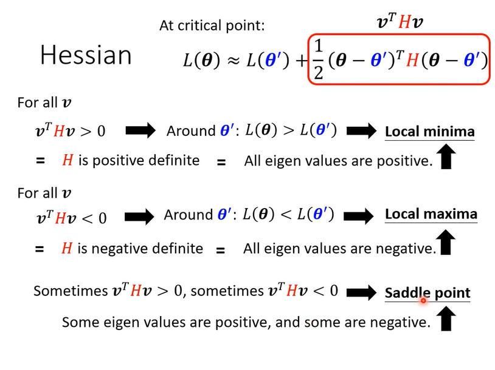
- # Example
  collapsed:: true
	- 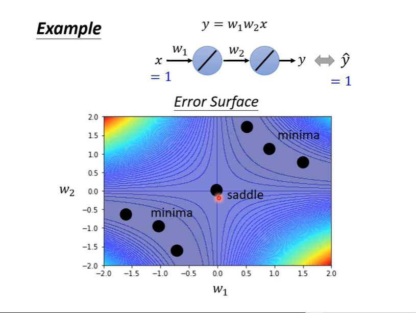
	- 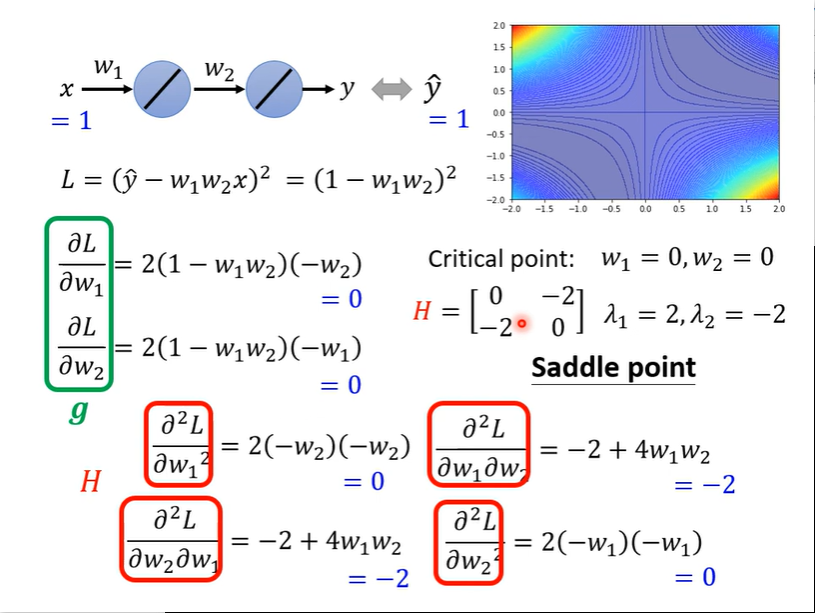
	-
- # Don't afraid of saddle point?
  collapsed:: true
	- introduction
	  collapsed:: true
		- 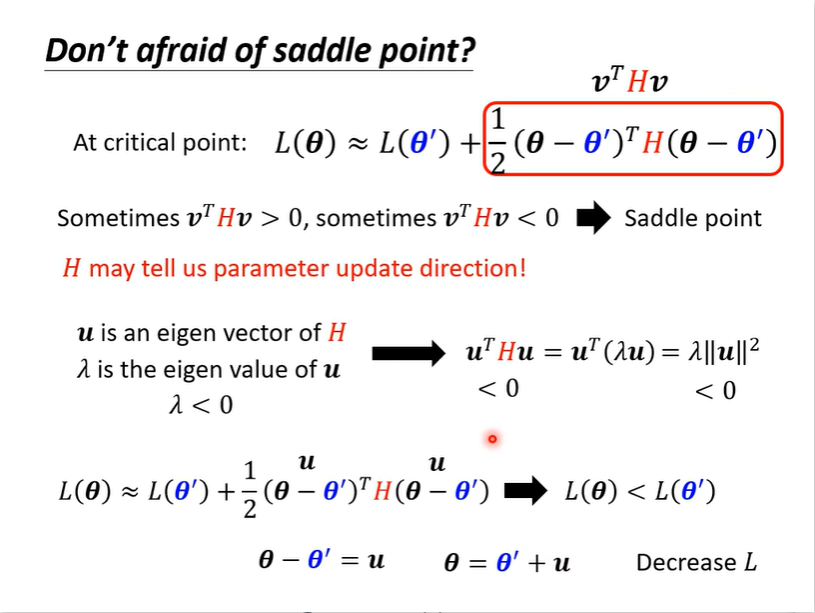
	- example
	  collapsed:: true
		- 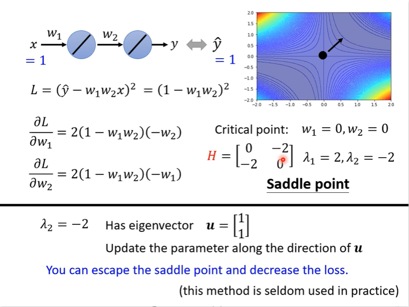
- # Saddle Point vs Local Minima
  collapsed:: true
	- Introduction
	  collapsed:: true
		- 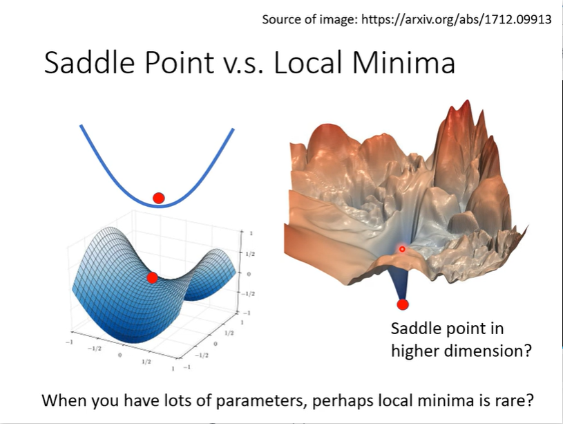
	- Empirical Study
	  collapsed:: true
		- 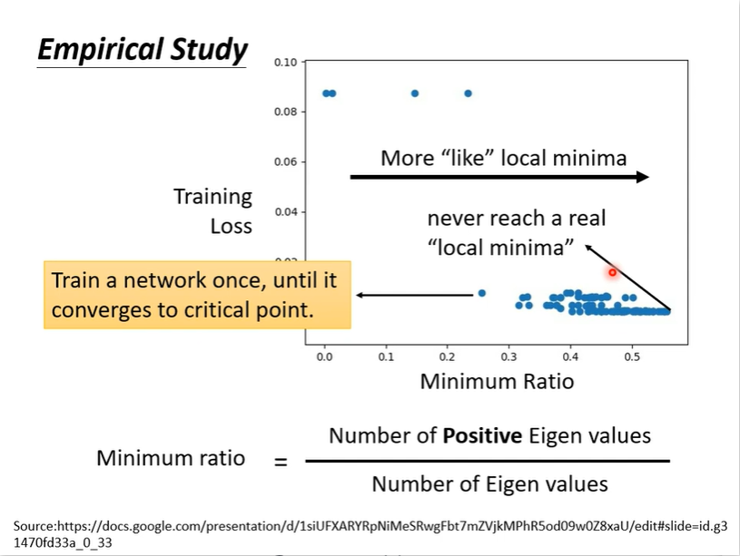
- # Smalll Gradient...
  collapsed:: true
	- 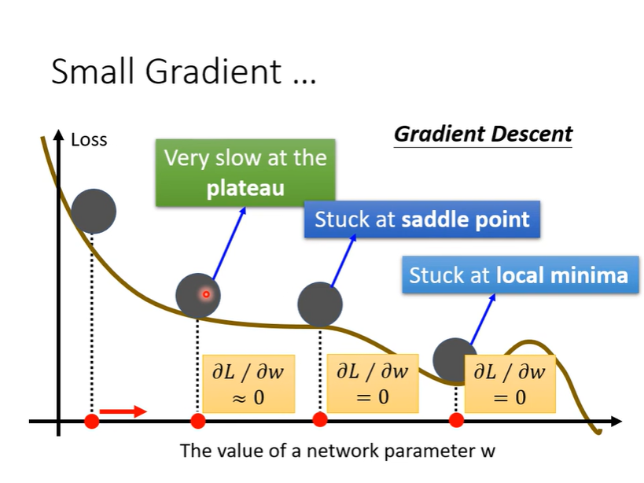
-