- 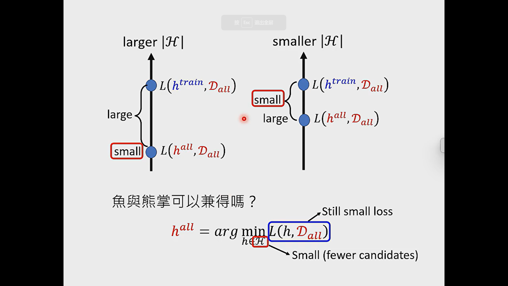
- # Why hidden layer?
  collapsed:: true
	- 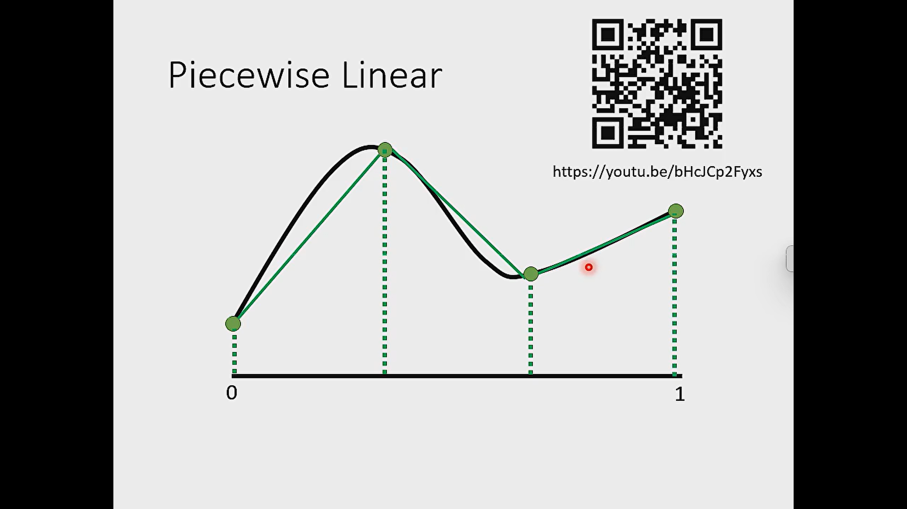
	- 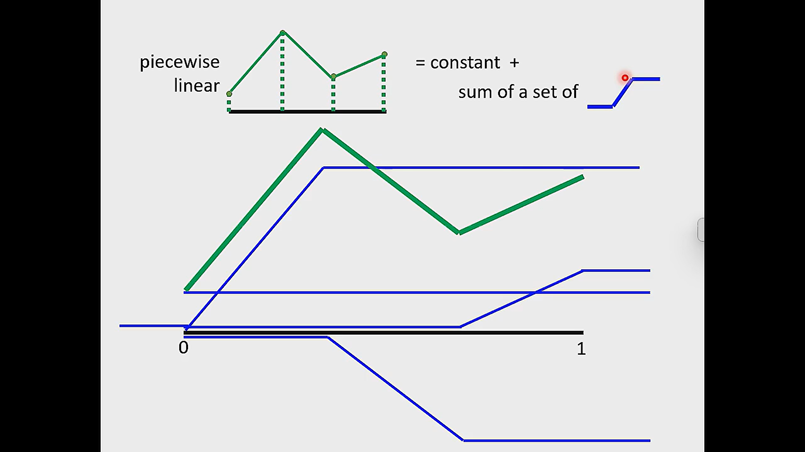
	- 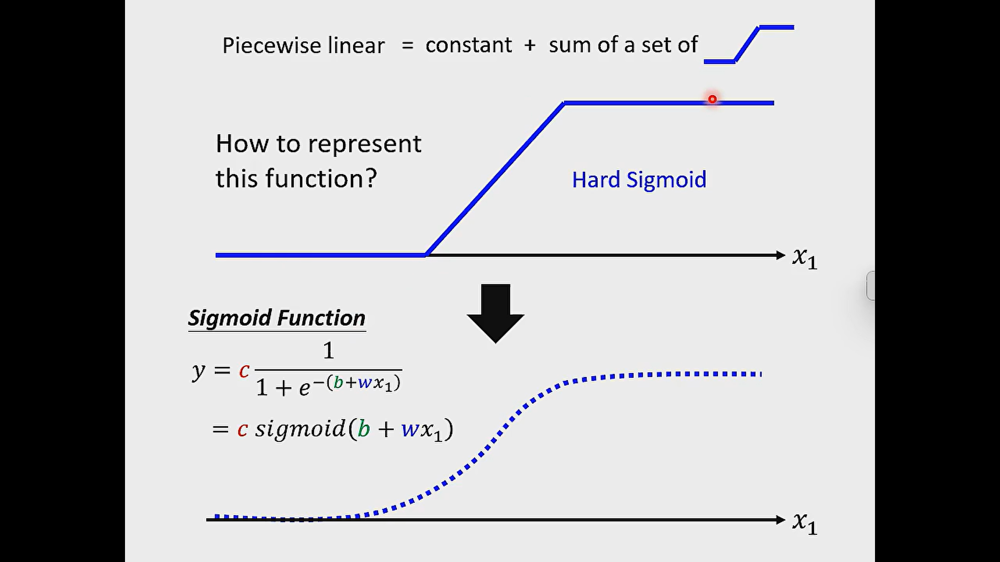
	- 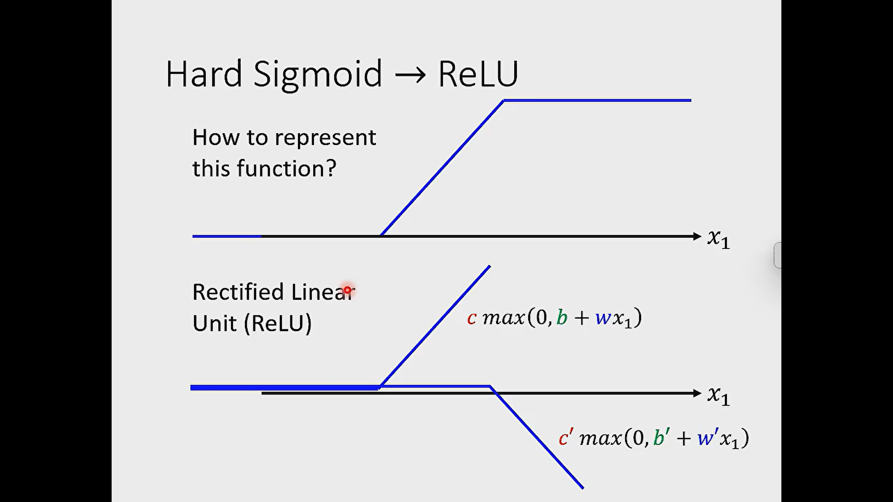
	- two relu can combine the hard sigmoid
- # Fat Neural network
  collapsed:: true
	- 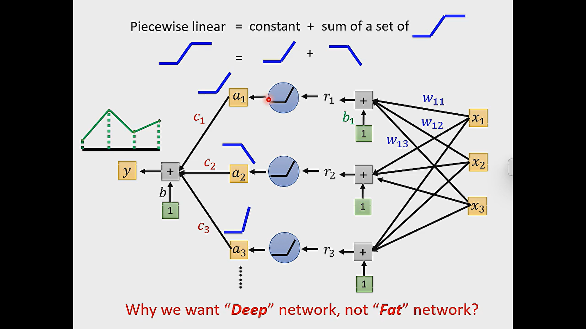
	- 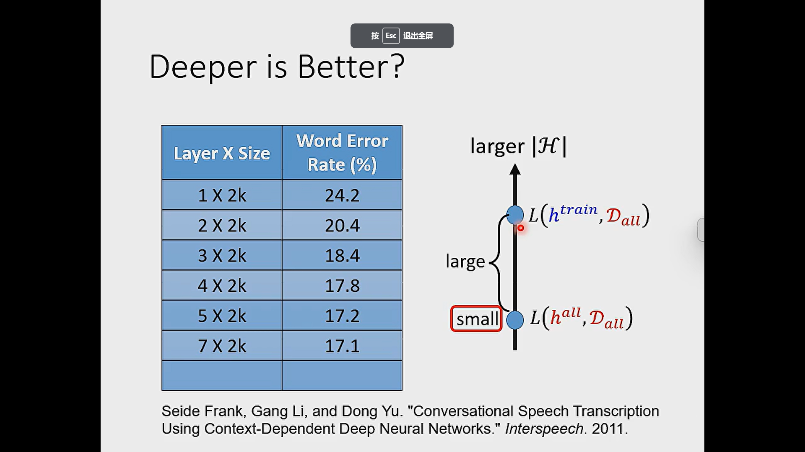
	- 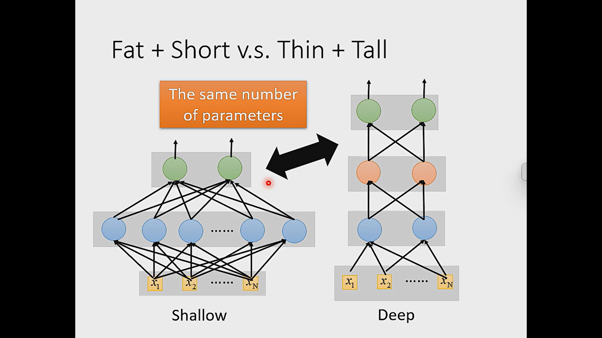
	- 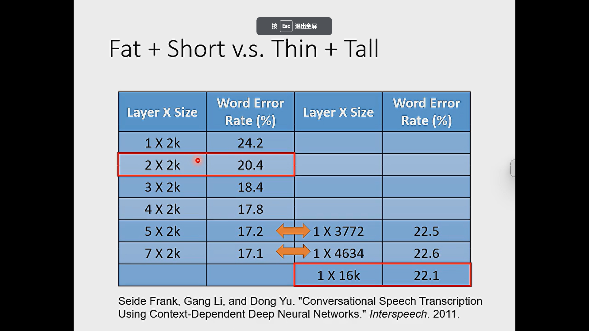
- # Why we need deep?
  collapsed:: true
	- 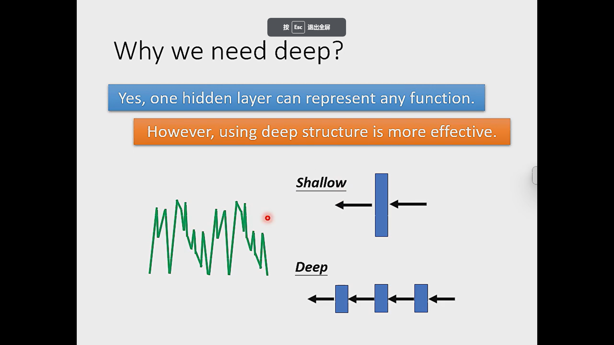
	- for a same function, the deep model parameters is less than fat network.
	-
- # Use Analogy to explain deep model is better
  collapsed:: true
	- 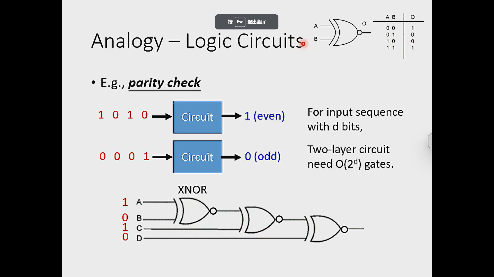
	- 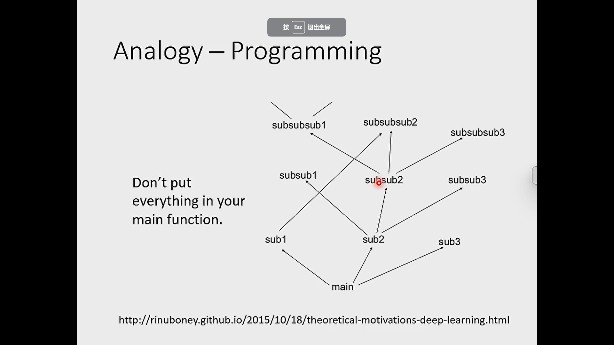
	- 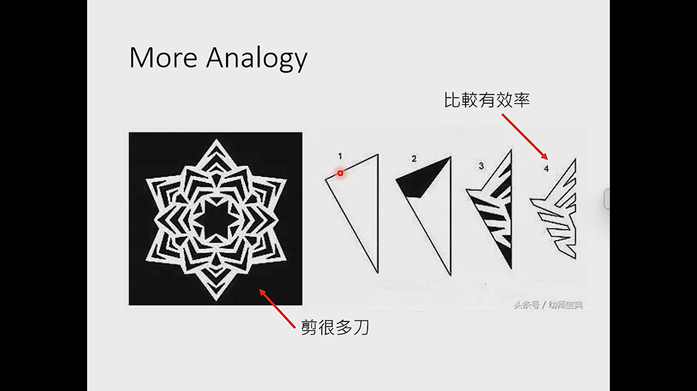
	-
-