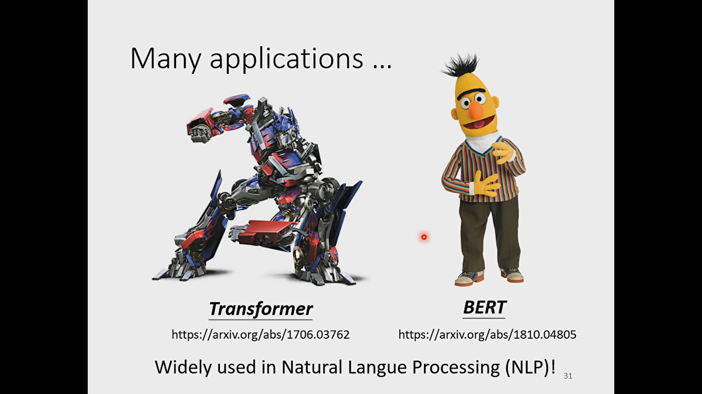
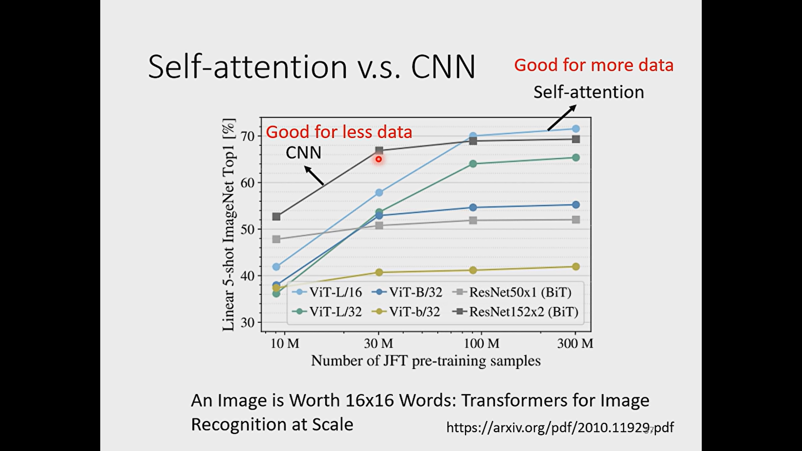

- 
- # how to use the $$a^i$$ to compute the $$b^i$$
  collapsed:: true
	- 
	- 
	- 
	- 
	-
- 
- # Multi-Head self-attention
	- 
	- 
- # positional encoding
	- 
	- 
	- we don't need to give a huge windows to use self-attention
	- the position encoding is also a problem to be solved
	- 
	- 
	- 
	- 
	- 
	- 
	- 
	- 
- # to learn more
	- 
	-
-